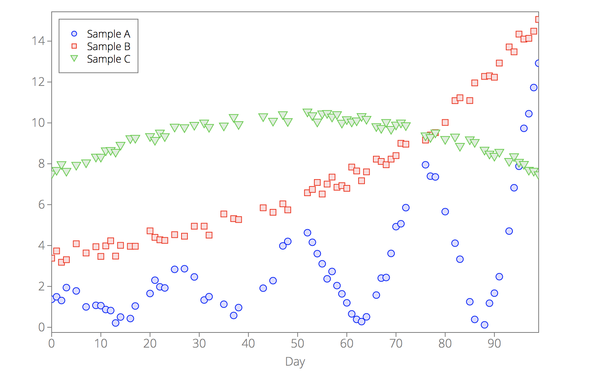
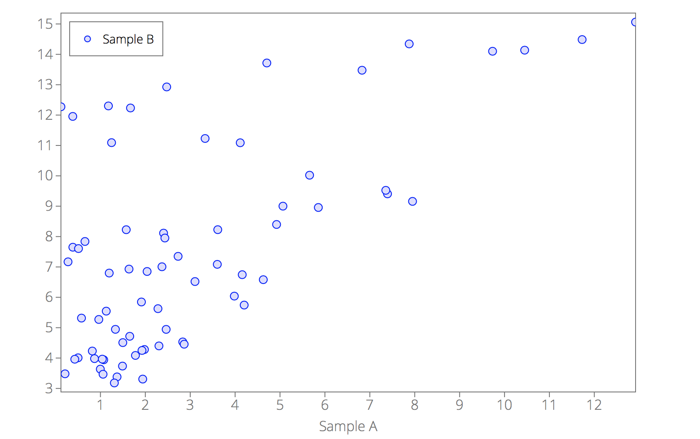
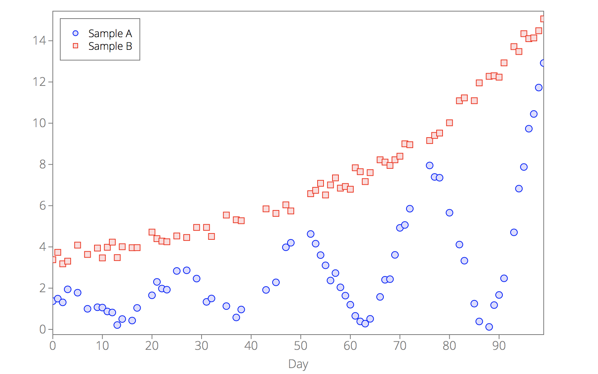
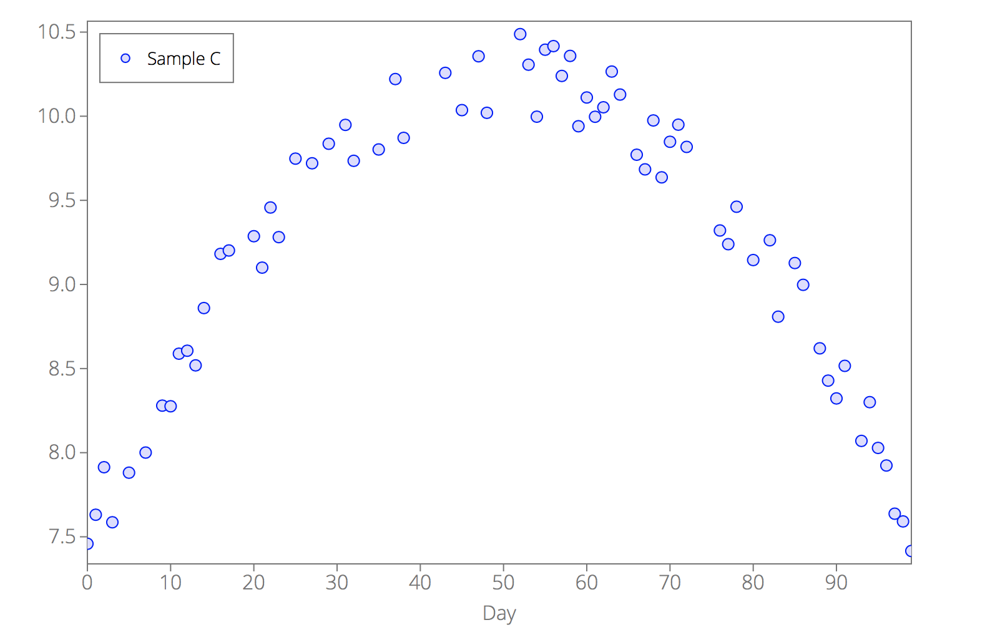
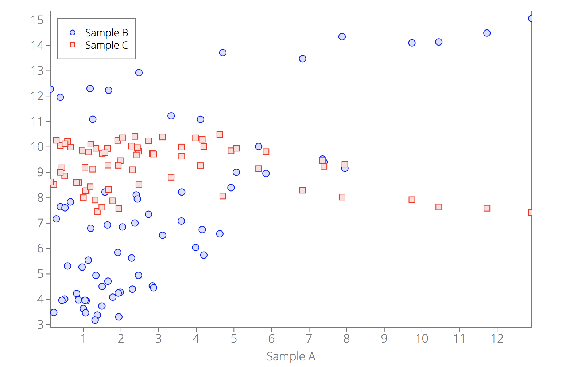
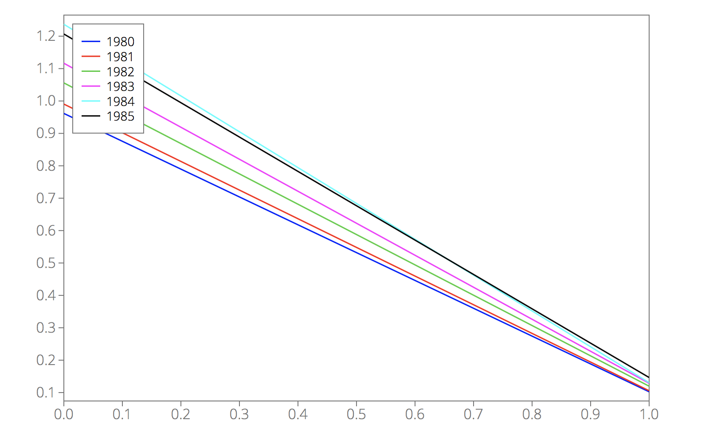
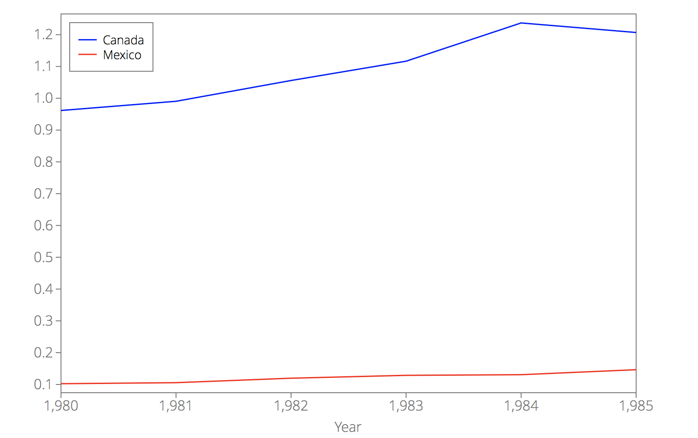

## <a name="Data"></a>`d3lines.Data(data)`

`d3lines.Data` is a prototype built for handling simple data-related tasks, like selecting data columns.

#### Example:

Suppose that you have the following `example2.csv`:

```
Day,Sample A,Sample B,Sample C
0,1.36978893471,3.38066609811,7.45844794384
1,1.49137655531,3.73562084117,7.63119347755
2,1.31017647221,3.18068192911,7.91360793457
3,1.94220556984,3.3077832707,7.58647498067
5,1.77968604686,4.08654857579,7.88098220595
7,0.997654022027,3.63538096353,8.00060374422
9,1.0733420551,3.94260109575,8.27977747233
10,1.05827381601,3.4675124496,8.27592568438
11,0.868382926097,3.98204649432,8.5884383334
12,0.81904420459,4.23153801748,8.60615909873
13,0.211346950485,3.48159582174,8.51885166262
14,0.502426110935,4.00882731717,8.85955705304
16,0.428451632712,3.96117944976,9.18180366264
17,1.04163792553,3.96417664929,9.20189324965
20,1.65277501927,4.71706610312,9.28660800814
21,2.30355686489,4.40055478386,9.10005351925
22,1.98011642352,4.28127578006,9.45732390058
23,1.92578819133,4.24988962377,9.2813438626
25,2.83355771364,4.531977732,9.74802805888
27,2.86510553,4.45628993545,9.72014913369
29,2.46391268367,4.94468815819,9.83643787802
31,1.33390118878,4.94602962698,9.94864620082
32,1.49865153895,4.5081845264,9.73482618335
35,1.12928356976,5.54484986623,9.80230835739
37,0.577915325874,5.3160935591,10.2208536926
38,0.963887752359,5.27097249312,9.87139312408
43,1.91308864095,5.84662048942,10.2575789957
45,2.28138866381,5.62614589185,10.0362131626
47,3.98233556726,6.03960751819,10.3564396765
48,4.20154102933,5.74450477186,10.0201650906
52,4.62734034229,6.58126399348,10.4879707942
53,4.1583600623,6.74476162006,10.3062670141
54,3.60289368004,7.08549438007,9.99730862968
55,3.10613029358,6.51947130176,10.3953371742
56,2.37063599917,7.00610102317,10.4167041786
57,2.72980165959,7.34890058783,10.2393033322
58,2.03934690879,6.85086377411,10.3584094022
59,1.63679377172,6.9296261582,9.94050716439
60,1.19564798487,6.79853084373,10.1114271712
61,0.655471774952,7.83847602017,9.99690581442
62,0.385796680674,7.64894687909,10.0531244406
63,0.278324384613,7.16921707316,10.2653275541
64,0.51113849592,7.604307368,10.1286850174
66,1.57461405987,8.2262377036,9.77114841935
67,2.40624734565,8.11356524606,9.68408544648
68,2.43529684566,7.95256231606,9.97495804536
69,3.61332159008,8.22750328326,9.63678093146
70,4.92327747654,8.39838248123,9.84821794504
71,5.06532411968,9.00167080446,9.94965846792
72,5.85338666451,8.9578441662,9.81770910251
76,7.95126311533,9.15882518405,9.320794114
77,7.39387324551,9.40653560907,9.23932850863
78,7.3560307929,9.52281438728,9.46205751247
80,5.65850626333,10.0206385502,9.14498445324
82,4.11375029892,11.088206372,9.26279650048
83,3.33141152116,11.2291596108,8.80828285438
85,1.24794738328,11.0923759382,9.1272399739
86,0.383933826093,11.9565979759,8.99766245759
88,0.12056697819,12.2736856997,8.62030045971
89,1.17790151531,12.3018139038,8.42843589536
90,1.6695839921,12.2338390187,8.32240562087
91,2.47604417627,12.9268026429,8.51609928178
93,4.70595987669,13.7153127875,8.06990380397
94,6.82692246401,13.4768857118,8.30022925411
95,7.87689619998,14.3432131529,8.02836320274
96,9.73399572755,14.1008412337,7.92389526433
97,10.4488214849,14.1375429697,7.63726835332
98,11.7286960169,14.4860340892,7.59136934731
99,12.9190593149,15.0618799918,7.41576150465
```

```javascript
d3.csv("example2.csv", function(error, data) {

    var D = new d3lines.Data(data)

    var options = {
        data: D,
        xkey: "Day",
        plot_type: "scatter"
    };
    plt = d3lines.plot(svg, options);
});
```

<p align="center"></p>

### Arguments

- **`data`**: the data.

`d3lines.Data` accepts several data types:

1. An array of dictionaries

Example:

```javascript
var data = [{In: 67.3, Out: 56.5},
            {In: 73.1, Out: 59.1},
            {In: 71.9, Out: 58.7},
            {In: 74.3, Out: 53.3},
            {In: 77.7, Out: 49.2}];

var D = new d3lines.Data(data);
```

2. A dictionary of arrays

Example:

```js
var data = {In: [67.3, 73.1, 71.9, 74.3, 77.7],
            Out: [56.5, 59.1, 58.7, 53.3, 49.2]};

var D = new d3lines.Data(data);
```

3. An array (or an array of arrays)

Example:

```js
var data = [[67.3, 56.5],
            [73.1, 59.1],
            [71.9, 58.7],
            [74.3, 53.3],
            [77.7, 49.2]];

var D = new d3lines.Data(data);
```

### Properties

- **`data`**: the data in the form of an array of dictionaries:

```js
var data = {In: [67.3, 73.1, 71.9, 74.3, 77.7],
            Out: [56.5, 59.1, 58.7, 53.3, 49.2]};

var D = new d3lines.Data(data);

// D.data = [{In: 67.3, Out: 56.5},
//           {In: 73.1, Out: 59.1},
//           {In: 71.9, Out: 58.7},
//           {In: 74.3, Out: 53.3},
//           {In: 77.7, Out: 49.2}]
```

### Methods

- **`filterColumns(filterFunc)`**: filters the columns based on a function that will be applied to all column names.

Example:

```javascript
d3.csv("example2.csv", function(error, data) {

    var D = new d3lines.Data(data)
        .filterColumns(function(c){return c.startsWith("Sample") && !c.endsWith("C")});

    var options = {
        data: D,
        xkey: "Sample A",
        plot_type: "scatter"
    };
    plt = d3lines.plot(svg, options);
});
```

<p align="center"></p>


- **`ignoreColumns(columns)`**: ignores columns based on the provided array of column names.

Example:

```javascript
d3.csv("example2.csv", function(error, data) {

    var D = new d3lines.Data(data)
        .ignoreColumns(["Sample C"]);

    var options = {
        data: D,
        xkey: "Day",
        plot_type: "scatter"
    };
    plt = d3lines.plot(svg, options);
});
```

<p align="center"></p>

- **`selectColumns(columns)`**: keeps columns based on the provided array of column names.

Example:

```javascript
d3.csv("example2.csv", function(error, data) {

    var D = new d3lines.Data(data)
        .selectColumns(["Day", "Sample C"]);

    var options = {
        data: D,
        xkey: "Day",
        plot_type: "scatter"
    };
    plt = d3lines.plot(svg, options);
});
```

<p align="center"></p>

- **`sample([start, end])`**: keeps columns based on column numbers.

Example:

```javascript
d3.csv("example2.csv", function(error, data) {
    
    var D = new d3lines.Data(data)
        .sample(1, 4);

    var options = {
        data: D,
        xkey: "Sample A",
        plot_type: "scatter",
    };
    plt = d3lines.plot(svg, options);
});
```

<p align="center"></p>

- **`sanitize()`**: cleans up the data in order to be able to plot it.

    This method will do the following things:
    
    - remove empty data points:
    
        Example:
    
        ```javascript
        var data = [{},{x: 3}];
        var D = new d3lines.Data(data).sanitize();
        // D.data = [{x: 3}]
        ```
    
    - attempts to convert strings to dates or floats. If conversion is not successful, a value of NaN will be used.
    
         Example:
    
        ```javascript
        var data = [{date: "Jan 3, 2017", x: "3.5", category: "AAA"},
                    {date: "Jan 7, 2017", x: "7.1", category: "BBB"},
                    {date: "Jan 13, 2017", x: "some_string", category: "CCC"}];
        var D = new d3lines.Data(data).sanitize();
        // D.data = [{date: Tue Jan 03 2017 00:00:00 GMT-0800 (PST), x: 3.5, category: NaN},
        //           {date: Sat Jan 07 2017 00:00:00 GMT-0800 (PST), x: 7.1, category: NaN},
        //           {date: Fri Jan 13 2017 00:00:00 GMT-0800 (PST), x: NaN, category: NaN}]
        ```
    
- **`transpose([lineNameKey, xkey])`**: transposes a data matrix. 

    Optional arguments:
    
    - `lineNameKey`: name of the column that holds the line names,
    - `xkey`: name that you want to give to the first column after transposing the data.

    Suppose we have a `example_transpose.csv` file with the following content:
    
    ```
    ,1980,1981,1982,1983,1984,1985
    Canada,0.96156,0.99047,1.05584,1.11653,1.23682,1.20679
    Mexico,0.10239,0.10562,0.11967,0.12869,0.13071,0.14646
    ```
    
    Suppose we would like to plot the data for Canada and Mexico as a function of the year.
    Let's try to plot it.
    
    ```javascript
    d3.csv("example_transpose.csv", function(error, data) {    
        var options = {
            data: data,
        };
        plt = d3lines.plot(svg, options);
    });
    ```
    
    <p align="center"></p>
  
    Well, not exactly what we're after. It plotted every year as a separate line, that's because the lines are defined by the columns and not the rows.
    So we need to transpose the data:
    
    ```javascript
    d3.csv("example_transpose.csv", function(error, data) {
        var D = new d3lines.Data(data)
            .transpose("", "Year");
        var options = {
            data: D,
            xkey: "Year",
            xticks: 5,
        };
        plt = d3lines.plot(svg, options);
    });
    ```
    
    <p align="center"></p>
      
    Now, that's much better. Let's see how the data looks like before and after transposing it. Before:
    
    ```javascript
    var D = new d3lines.Data(data);
    \\ D.data = [{1980: "0.96156", 1981: "0.99047", 1982: "1.05584", 1983: "1.11653", 1984: "1.23682", 1985: "1.20679", : "Canada"},
    \\           {1980: "0.10239", 1981: "0.10562", 1982: "0.11967", 1983: "0.12869", 1984: "0.13071", 1985: "0.14646", : "Mexico"}]
    ```
    
    And after:
    
    ```javascript
    D = D.transpose("", "Year");
    \\ D.data = [{Year: "1980", Canada: "0.96156", Mexico: "0.10239"},
    \\           {Year: "1981", Canada: "0.99047", Mexico: "0.10562"},
    \\           {Year: "1982", Canada: "1.05584", Mexico: "0.11967"},
    \\           {Year: "1983", Canada: "1.11653", Mexico: "0.12869"},
    \\           {Year: "1984", Canada: "1.23682", Mexico: "0.13071"},
    \\           {Year: "1985", Canada: "1.20679", Mexico: "0.14646"}]
    ```
