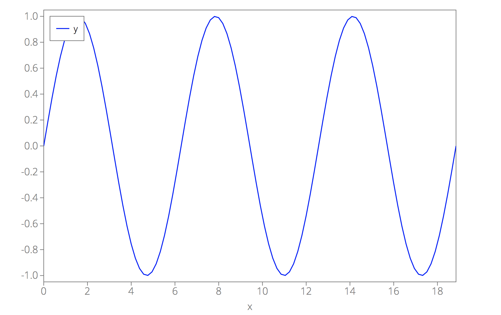
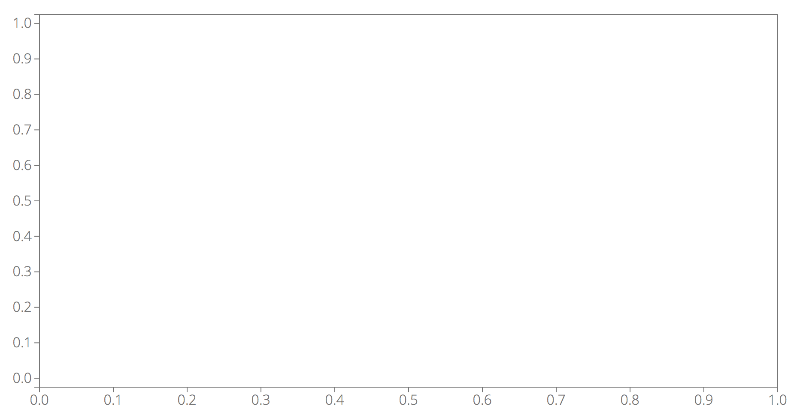
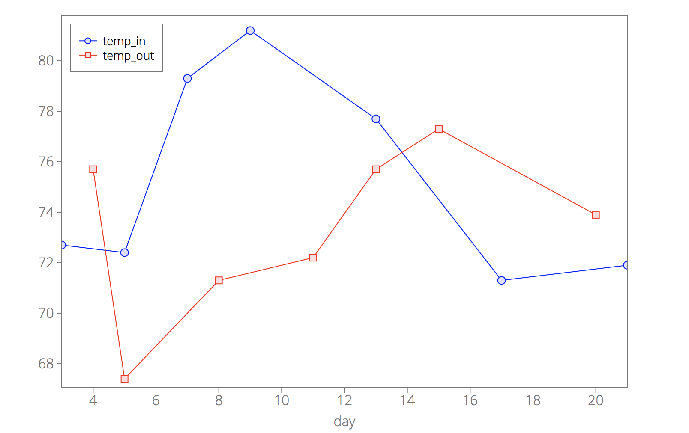

## <a name="plot"></a>`d3lines.plot(svg[, options, previousChart])`

Creates a plot and appends it to the `svg` tag. `svg` should be a D3 selection object. 
This method returns a [`d3lines.Chart`](d3lines_Chart.md#Chart) object.

#### Example

```javascript
// Create data
var npts = 100;
var x = Array.apply(null, Array(npts)).map(function (_, i) {return i/(npts-1)*6*Math.PI;});
var y = Array.apply(null, Array(npts)).map(function (_, i) {return Math.sin(x[i]);});
data = {x: x, y: y};
// Select svg tag
var svg = d3.select("#main-svg");
// plot data
d3lines.plot(svg, {data: data, xkey: "x"});
```

<p align="center"></p>

### Arguments

- `svg`: a D3 selection object of an `svg` tag.

### Optional arguments

- [`options`](d3lines_plot.md#plot_options): object containing all chart options including the data.
- [`previousChart`](d3lines_plot.md#plot_previouschart): [`d3lines.Chart`](d3lines_Chart.md) object representing an existing chart. 
This allows to add lines from the same or another data source to an existing chart.

For example, if you have an `svg` tag with the ID "main-svg":

```javascript
var svg = d3.select("#main-svg");
```

Without specifying any option, you will get an empty plot with default axes:

```javascript
d3lines.plot(svg);
```

<p align="center"></p>

#### <a name="plot_options"></a>`options`

`options` is an object that specifies all optional chart parameters. For example:

```javascript
var options = {
    data: data,
    xkey: "Year",
    yscale_type: "log",
    ygrid: true,
    legend_position: "top right",
};
```

Here is a list of possible options, grouped by categories, and what their effect is on the chart.
We split the options into the following categories:

* [Data](d3lines_plot_data.md#plot_options_category_data) - options that define the data that you want to display.

    * [**`data`**](d3lines_plot_data.md#plot_option_data) - the data that you want to display.
    * [**`xkey`**](d3lines_plot_data.md#plot_option_xkey) - the name of the data field for the x-axis.

* [Lines](d3lines_plot_lines.md#plot_options_category_lines) - options that define the look and style of the lines or markers.

    * [**`line_color`**](d3lines_plot_lines.md#plot_option_line_color) - a color or an array of colors for the lines.
    * [**`line_width`**](d3lines_plot_lines.md#plot_option_line_width) - a width/thickness or an array of widths for the lines.
    * [**`line_style`**](d3lines_plot_lines.md#plot_option_line_style) - a style (solid, dotted, ...) or an array of styles for the lines.
    * [**`line_fill`**](d3lines_plot_lines.md#plot_option_line_fill) - a fill color or an array of fill colors for the areas under the lines.
    * [**`line_fill_opacity`**](d3lines_plot_lines.md#plot_option_line_fill_opacity) - a fill opacity or an array of fill opacities for the areas under the lines.
    * [**`marker`**](d3lines_plot_lines.md#plot_option_marker) - a marker/symbol or an array of markers for the lines.
    * [**`marker_fill`**](d3lines_plot_lines.md#plot_option_marker_fill) - a fill color or an array of fill colors for the markers.
    * [**`marker_fill_opacity`**](d3lines_plot_lines.md#plot_option_marker_fill_opacity) - a fill opacity or an array of fill opacities for the markers.
    * [**`marker_stroke_width`**](d3lines_plot_lines.md#plot_option_marker_stroke_width) - a width/thickness or an array of widths for the marker edges.
    * [**`marker_size`**](d3lines_plot_lines.md#plot_option_marker_size) - a size or an array of sizes for the markers.
    * [**`line_yaxis`**](d3lines_plot_lines.md#plot_option_line_yaxis) - specifies the y-axis (left or right) for the lines.
    * [**`plot_type`**](d3lines_plot_lines.md#plot_option_plot_type) - Line or scatter plot.

* [Geometry](d3lines_plot_geometry.md#plot_options_category_geometry) - Options related to the geometry of the plot.

    * [**`width`**](d3lines_plot_geometry.md#plot_option_width) - the width of the svg element.
    * [**`height`**](d3lines_plot_geometry.md#plot_option_height) - the height of the svg element.
    * [**`margins`**](d3lines_plot_geometry.md#plot_option_margins) - the margins between the edges of the svg element and the plotting area.

* [All axes](d3lines_plot_allaxes.md#plot_options_category_allaxes) - Options related to the look/style of all axes.

    * [**`box`**](d3lines_plot_allaxes.md#plot_option_box) - set to true (default) if you want a box drawn around the plotting area.
    * [**`axes_color`**](d3lines_plot_allaxes.md#plot_option_axes_color) - line color for the axes.
    * [**`axes_width`**](d3lines_plot_allaxes.md#plot_option_axes_width) - line width for the axes.
    * [**`axes_linestyle`**](d3lines_plot_allaxes.md#plot_option_axes_linestyle) - line style for the axes.
    * [**`axes_fill`**](d3lines_plot_allaxes.md#plot_option_axes_fill) - background color of the plotting area.
    * [**`axes_fill_opacity`**](d3lines_plot_allaxes.md#plot_option_axes_fill_opacity) - background opacity of the plotting area.
    * [**`axes_font_size`**](d3lines_plot_allaxes.md#plot_option_axes_font_size) - font size for the axes.
    * [**`axes_font_color`**](d3lines_plot_allaxes.md#plot_option_axes_font_color) - font color for the axes.
    * [**`axes_font_family`**](d3lines_plot_allaxes.md#plot_option_axes_font_family) - font family for the axes.

* [X-AXIS, Y-AXIS, Y2-AXIS](d3lines_plot_axis.md#plot_options_category_axes) - Options specific to one of the axes.

    * [**`xscale_type`**, **`yscale_type`**, **`y2scale_type`**](d3lines_plot_axis.md#plot_option_xscale_type) - scale type (linear, log or time) for the x-, y- or y2-axis.
    * [**`xlabel`**, **`ylabel`**, **`y2label`**](d3lines_plot_axis.md#plot_option_xlabel) - label for the x-, y- or y2-axis.
    * [**`xlabel_offset`**, **`ylabel_offset`**, **`y2label_offset`**](d3lines_plot_axis.md#plot_option_xlabel_offset) - label position offset for the x-, y- or y2-axis.
    * [**`xlim`**, **`ylim`**, **`y2lim`**](d3lines_plot_axis.md#plot_option_xlim) - limits for the x-, y- or y2-axis.
    * [**`xticks`**, **`yticks`**, **`y2ticks`**](d3lines_plot_axis.md#plot_option_xticks) - number of ticks for the x-, y- or y2-axis.
    * [**`xtick_format`**, **`ytick_format`**, **`y2tick_format`**](d3lines_plot_axis.md#plot_option_xtick_format) - tick-formatting for the x-, y- or y2-axis.
    * [**`xgrid`**, **`ygrid`**, **`y2grid`**](d3lines_plot_axis.md#plot_option_xgrid) - set to true if you want a grid for the x-, y- or y2-axis. Default value: false.
    * [**`xgrid_color`**, **`ygrid_color`**, **`y2grid_color`**](d3lines_plot_axis.md#plot_option_xgrid_color) - line color for the grid.
    * [**`xgrid_width`**, **`ygrid_width`**, **`y2grid_width`**](d3lines_plot_axis.md#plot_option_xgrid_width) - line width for the grid.
    * [**`xgrid_linestyle`**, **`ygrid_linestyle`**, **`y2grid_linestyle`**](d3lines_plot_axis.md#plot_option_xgrid_linestyle) - line style for the grid.

* [Legend](d3lines_plot_legend.md#plot_options_category_legend) - Options related to the chart legend.

    * [**`legend`**](d3lines_plot_legend.md#plot_option_legend) - set to true (default) if you want a legend.
    * [**`legend_position`**](d3lines_plot_legend.md#plot_option_legend_position) - legend position.
    * [**`legend_labels`**](d3lines_plot_legend.md#plot_option_legend_labels) - array of legend labels.
    * [**`legend_border_color`**](d3lines_plot_legend.md#plot_option_legend_border_color) - border color for the legend.
    * [**`legend_border_width`**](d3lines_plot_legend.md#plot_option_legend_border_width) - border width for the legend.
    * [**`legend_border_style`**](d3lines_plot_legend.md#plot_option_legend_border_style) - border style for the legend.
    * [**`legend_fill`**](d3lines_plot_legend.md#plot_option_legend_fill) - background color of the legend.
    * [**`legend_fill_opacity`**](d3lines_plot_legend.md#plot_option_legend_fill_opacity) - background opacity of the legend.
    * [**`legend_font_size`**](d3lines_plot_legend.md#plot_option_legend_font_size) - font size for the legend.
    * [**`legend_font_color`**](d3lines_plot_legend.md#plot_option_legend_font_color) - font color for the legend.
    * [**`legend_font_family`**](d3lines_plot_legend.md#plot_option_legend_font_family) - font family for the legend.

* [Interactivity](d3lines_plot_interactive.md#plot_options_category_interactivity) - Options related to the interactivity of the plot.

    * [**`interactive`**](d3lines_plot_interactive.md#plot_option_interactive) - set to true (default) if you want an interactive plot.
    * [**`interactive_options`**](d3lines_plot_interactive.md#plot_option_interactive_options) - dictionary of interactive options.
        * [**`snap_axis`**](d3lines_plot_interactive.md#plot_option_interactive_snap_axis) - which axis should your mouse snap to.
        * [**`line`**](d3lines_plot_interactive.md#plot_option_interactive_line) - set to true (default) if you want an interactive line when hovering over the plot.
        * [**`line_color`**](d3lines_plot_interactive.md#plot_option_interactive_line_color) - color of the interactive line.
        * [**`line_width`**](d3lines_plot_interactive.md#plot_option_interactive_line_width) - width of the interactive line.
        * [**`line_style`**](d3lines_plot_interactive.md#plot_option_interactive_line_style) - style of the interactive line.
        * [**`dots`**](d3lines_plot_interactive.md#plot_option_interactive_dots) - set to true (default) if you want dots corresponding to your data when hovering over the plot.
        * [**`dot_radius`**](d3lines_plot_interactive.md#plot_option_interactive_dot_radius) - radius of the dots.
        * [**`textbox`**](d3lines_plot_interactive.md#plot_option_interactive_textbox) - set to true (default) if you want a textbox with data information when hovering over the plot.
        * [**`box_fill`**](d3lines_plot_interactive.md#plot_option_interactive_box_fill) - background color of the textbox.
        * [**`box_fill_opacity`**](d3lines_plot_interactive.md#plot_option_interactive_box_fill_opacity) - background opacity of the textbox.
        * [**`box_padding`**](d3lines_plot_interactive.md#plot_option_interactive_box_padding) - padding between the border of the box and the text.
        * [**`font_size`**](d3lines_plot_interactive.md#plot_option_interactive_font_size) - font size for the textbox.
        * [**`font_color`**](d3lines_plot_interactive.md#plot_option_interactive_font_color) - font color for the textbox.
        * [**`font_family`**](d3lines_plot_interactive.md#plot_option_interactive_font_family) - font family for the textbox.
        * [**`output_string`**](d3lines_plot_interactive.md#plot_option_interactive_output_string) - specifies the text that you want to write in the text box.
        * [**`zoom`**](d3lines_plot_interactive.md#plot_option_interactive_zoom) - set to true (default) if you want zooming to be enabled.

#### <a name="plot_previouschart"></a>`previousChart`

- `previousChart` is a [`d3lines.Chart`](d3lines_Chart.md) object representing an existing chart. 
This allows to add lines from the same or another data source to an existing chart.

For example,

```javascript
var svg = d3.select("#main-svg");

var data1 = [{day: 3, temp_in: 72.7},
             {day: 5, temp_in: 72.4},
             {day: 7, temp_in: 79.3},
             {day: 9, temp_in: 81.2},
             {day: 13, temp_in: 77.7},
             {day: 17, temp_in: 71.3},
             {day: 21, temp_in: 71.9}];
var options1 = {
    data: data1,
    xkey: "day",
    plot_type: "scatter",
    line_width: 1,
    interactive: false
}
plt1 = d3lines.plot(svg, options1);

var data2 = [{day: 4, temp_out: 75.7},
             {day: 5, temp_out: 67.4},
             {day: 8, temp_out: 71.3},
             {day: 11, temp_out: 72.2},
             {day: 13, temp_out: 75.7},
             {day: 15, temp_out: 77.3},
             {day: 20, temp_out: 73.9}];
var options2 = {
    data: data2,
    xkey: "day",
    plot_type: "scatter",
    line_width: 1
}
plt2 = d3lines.plot(svg, options2, plt1);
```

<p align="center"></p>

Note how `interactive` is false for the first chart and true (by default) for the second chart.
If interactive behavior is desired in such a chart with multiple datasets, we recommend to set it to false for all of the chart options except for the last one.
Otherwise, multiple events will fire at every mouse movement instead of one single event.