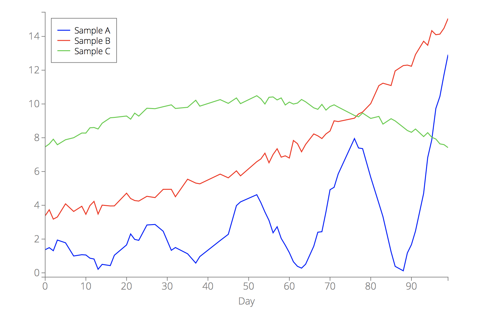
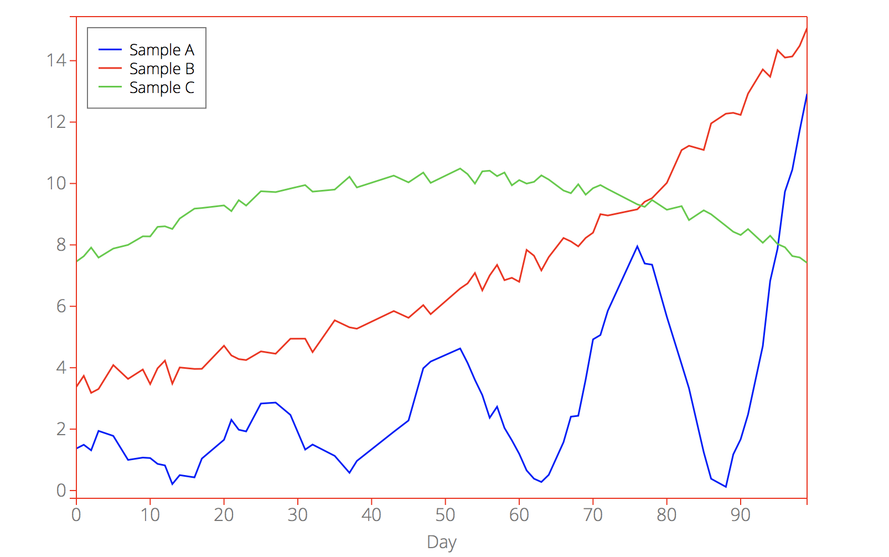
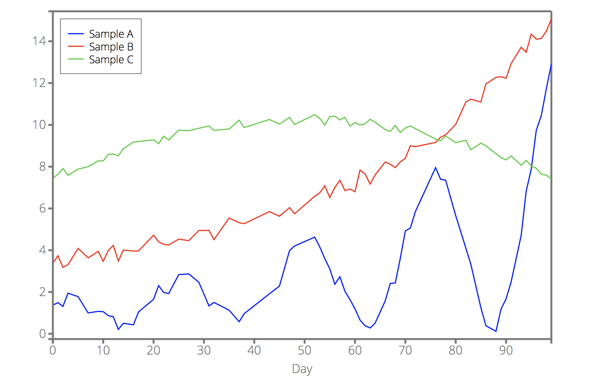
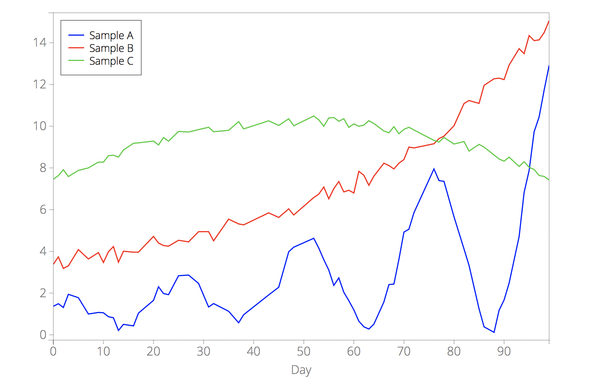
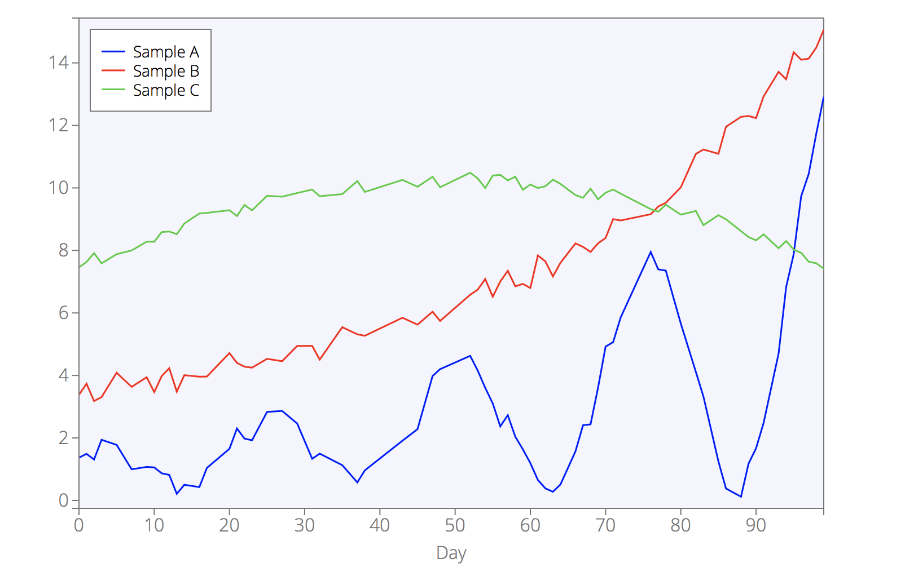
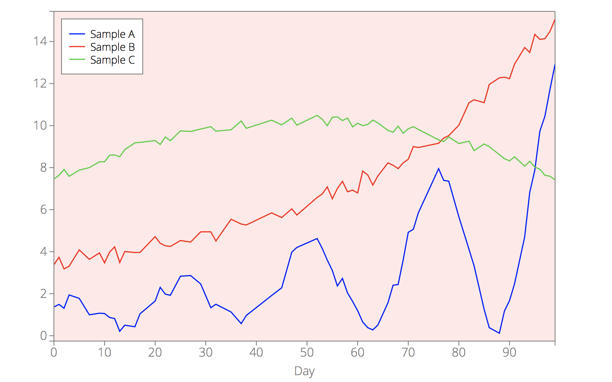
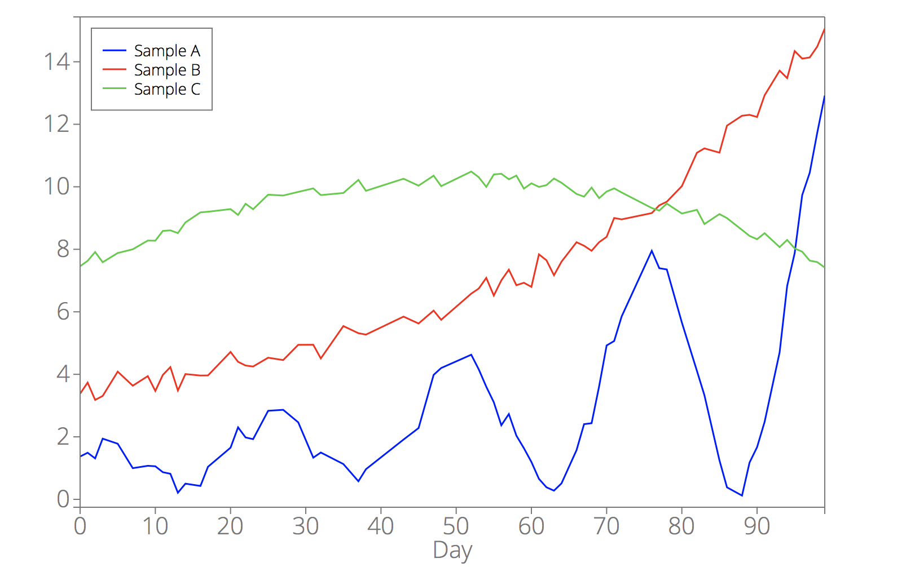
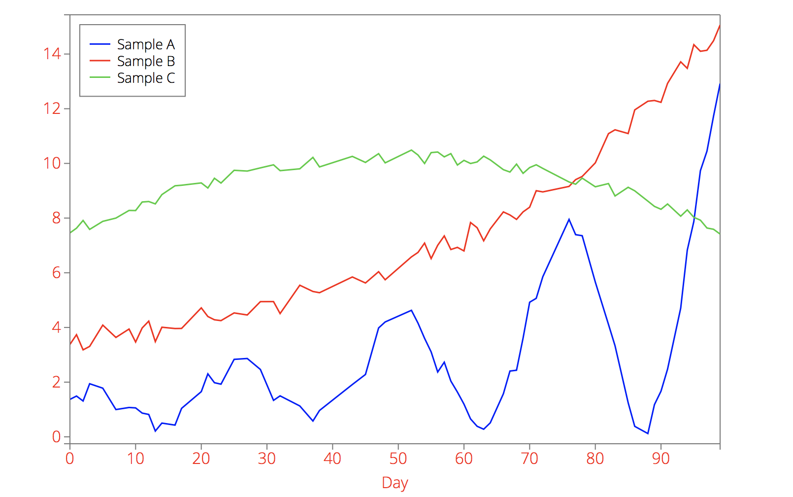
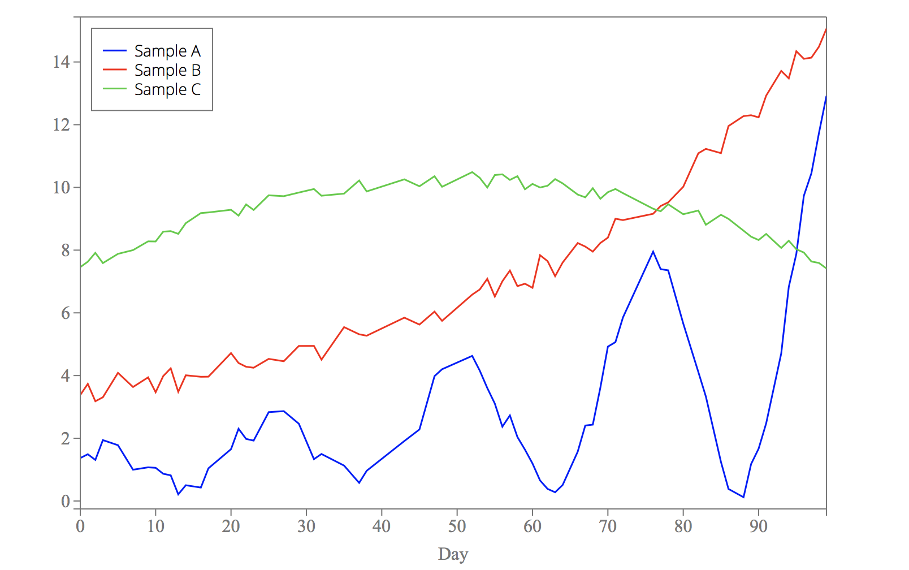

#### <a name="plot_options_category_allaxes"></a>Options for all axes

<!-- box -->
<a name="plot_option_box"></a>**`box`** - set to true (default) if you want a box drawn around the plotting area.

```javascript
d3.csv("example2.csv", function(error, data) {
    var options = {
        data: data,
        xkey: "Day",
        box: false,
    };
    d3lines.plot(svg, options);
});
```

<p align="center"></p>

----

<!-- axes_color -->
<a name="plot_option_axes_color"></a>**`axes_color`** - line color for the axes.
By default, `axes_color = "#777"`.
Note that this option will set the color of the axes only. To change the color of the axes's text, see [**`axes_font_color`**]("#plot_option_axes_font_color").

See [**`line_color`**](d3lines_plot_lines.md#plot_option_line_color) for color options.

```javascript
d3.csv("example2.csv", function(error, data) {
    var options = {
        data: data,
        xkey: "Day",
        axes_color: "red",
    };
    d3lines.plot(svg, options);
});
```

<p align="center"></p>

----

<!-- axes_width -->
<a name="plot_option_axes_width"></a>**`axes_width`** - line width for the axes. By default, `axes_width = 1`.

```javascript
d3.csv("example2.csv", function(error, data) {
    var options = {
        data: data,
        xkey: "Day",
        axes_width: 2.5,
    };
    d3lines.plot(svg, options);
});
```

<p align="center"></p>

----

<!-- axes_linestyle -->
<a name="plot_option_axes_linestyle"></a>**`axes_linestyle`** - line style for the axes. By default, `axes_linestyle = "-"` (solid).

See [**`line_style`**](d3lines_plot_lines.md#plot_option_line_style) for style options.

```javascript
d3.csv("example2.csv", function(error, data) {
    var options = {
        data: data,
        xkey: "Day",
        axes_linestyle: "dotted",
    };
    d3lines.plot(svg, options);
});
```

<p align="center"></p>

----

<!-- axes_fill -->
<a name="plot_option_axes_fill"></a>**`axes_fill`** - background color of the plotting area. By default, `axes_fill = "none"` (transparent).
Note that it only works when `box` is true.

See [**`line_color`**](d3lines_plot_lines.md#plot_option_line_color) for color options.

```javascript
d3.csv("example2.csv", function(error, data) {
    var options = {
        data: data,
        xkey: "Day",
        axes_fill: "#f5f5ff",
    };
    d3lines.plot(svg, options);
});
```

<p align="center"></p>

----

<!-- axes_fill_opacity -->
<a name="plot_option_axes_fill_opacity"></a>**`axes_fill_opacity`** - background opacity of the plotting area. By default, `axes_fill_opacity = 1.0` (opaque).
Note that it only works when `box` is true and when `axes_fill` is not set to "none".

```javascript
d3.csv("example2.csv", function(error, data) {
    var options = {
        data: data,
        xkey: "Day",
        axes_fill: "red",
        axes_fill_opacity: 0.1,
    };
    d3lines.plot(svg, options);
});
```

<p align="center"></p>

----

<!-- axes_font_size -->
<a name="plot_option_axes_font_size"></a>**`axes_font_size`** - font size for the axes.

```javascript
d3.csv("example2.csv", function(error, data) {
    var options = {
        data: data,
        xkey: "Day",
        axes_font_size: "18px",
    };
    d3lines.plot(svg, options);
});
```
<p align="center"></p>

----

<!-- axes_font_color -->
<a name="plot_option_axes_font_color"></a>**`axes_font_color`** - font color for the axes.

See [**`line_color`**](d3lines_plot_lines.md#plot_option_line_color) for color options.

```javascript
d3.csv("example2.csv", function(error, data) {
    var options = {
        data: data,
        xkey: "Day",
        axes_font_color: "red",
    };
    d3lines.plot(svg, options);
});
```

<p align="center"></p>

----

<!-- axes_font_family -->
<a name="plot_option_axes_font_family"></a>**`axes_font_family`** - font family for the axes.

```javascript
d3.csv("example2.csv", function(error, data) {
    var options = {
        data: data,
        xkey: "Day",
        axes_font_family: "'Times New Roman', Georgia, Serif"
    };
    d3lines.plot(svg, options);
});
```

<p align="center"></p>
