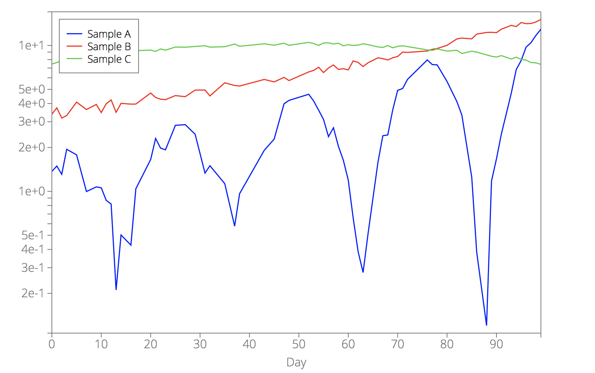
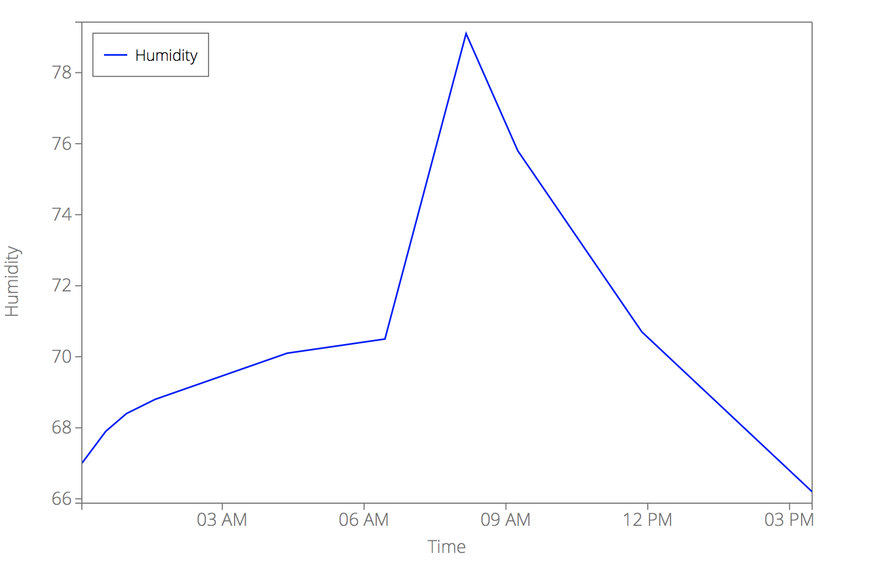
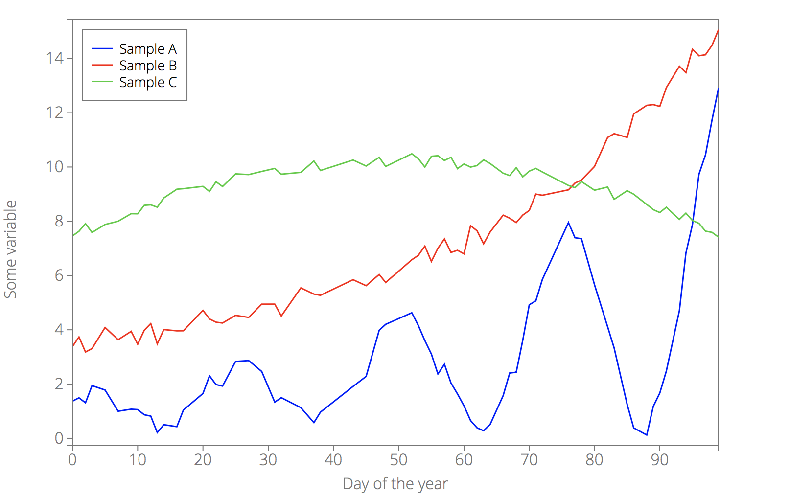
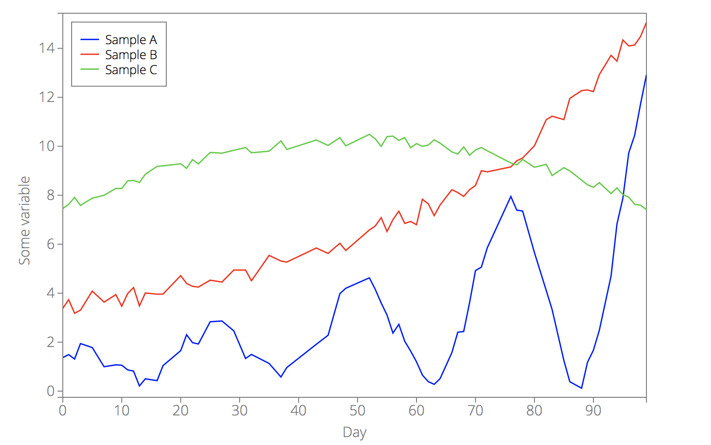
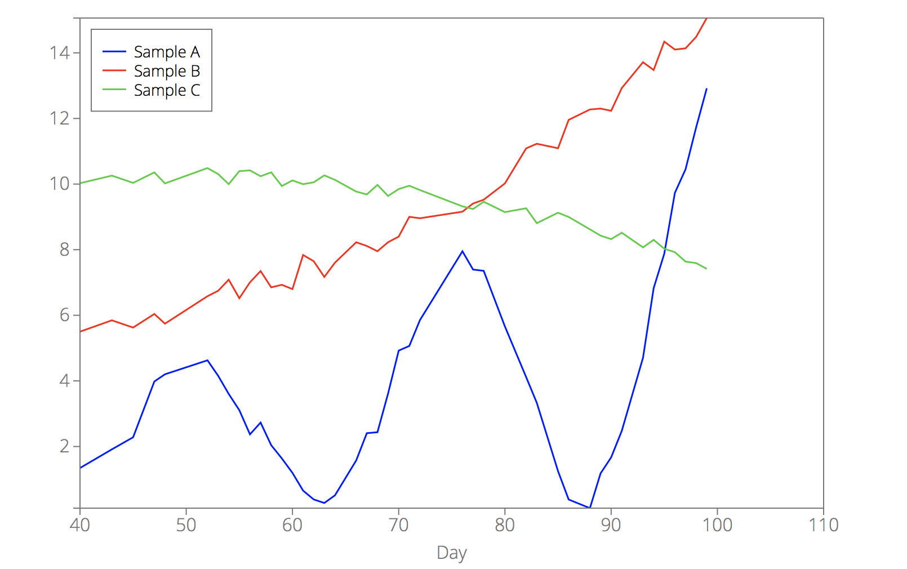
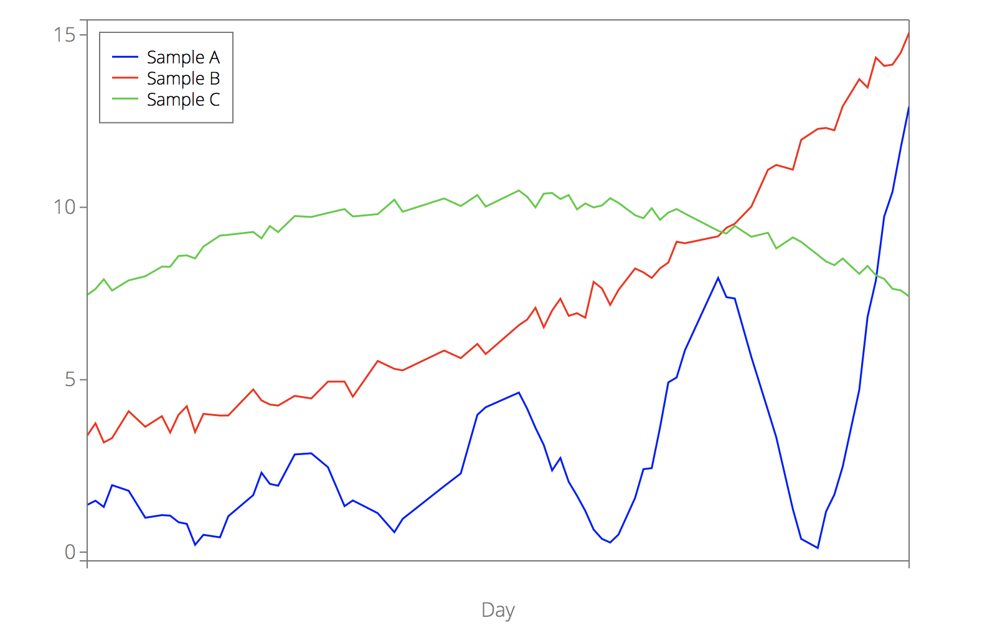
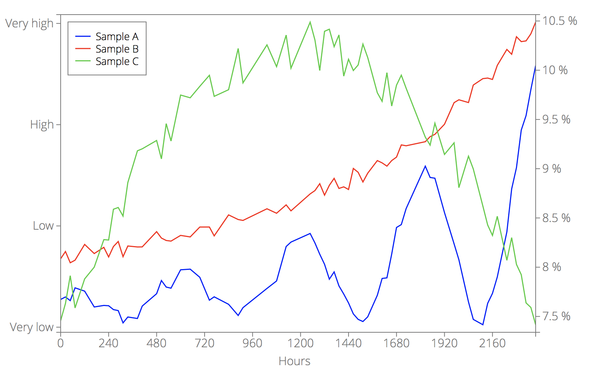
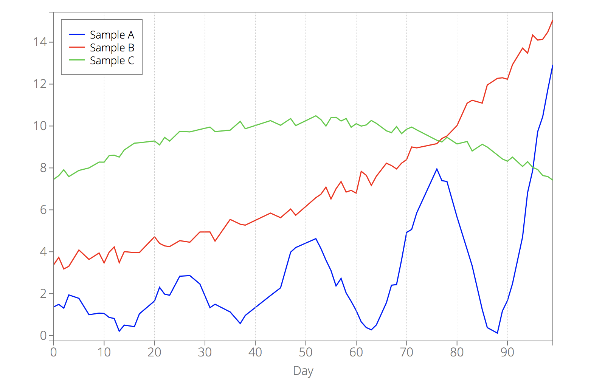
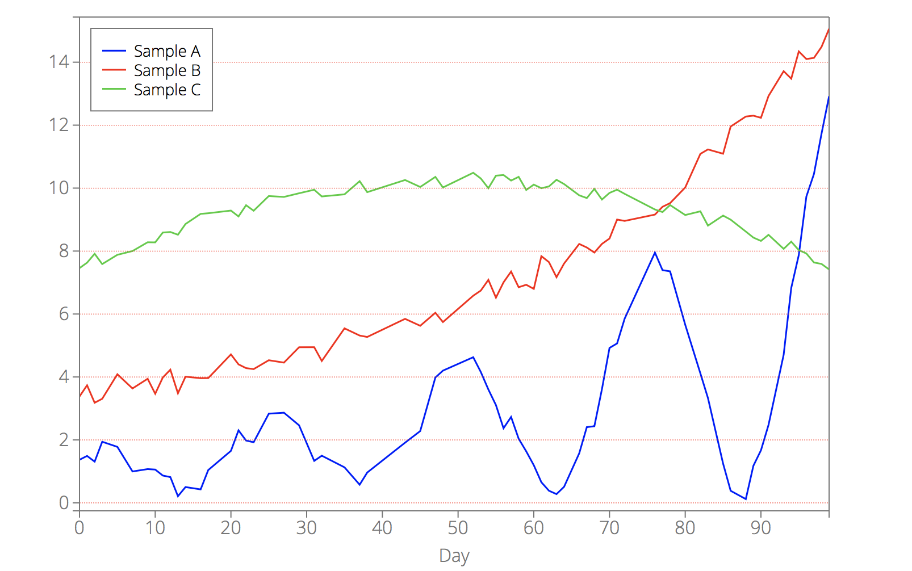
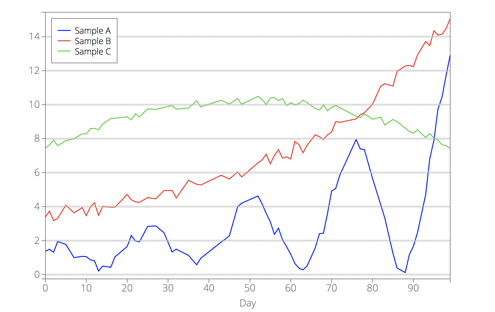

<em>

**Table of contents for [`d3lines.plot`](d3lines_plot.md)**

* [Data](d3lines_plot_data.md#plot_options_category_data) - options that define the data that you want to display.

    * [**`data`**](d3lines_plot_data.md#plot_option_data) - the data that you want to display.
    * [**`xkey`**](d3lines_plot_data.md#plot_option_xkey) - the name of the data field for the x-axis.

* [Lines](d3lines_plot_lines.md#plot_options_category_lines) - options that define the look and style of the lines or markers.

    * [**`line_color`**](d3lines_plot_lines.md#plot_option_line_color) - a color or an array of colors for the lines.
    * [**`line_width`**](d3lines_plot_lines.md#plot_option_line_width) - a width/thickness or an array of widths for the lines.
    * [**`line_style`**](d3lines_plot_lines.md#plot_option_line_style) - a style (solid, dotted, ...) or an array of styles for the lines.
    * [**`line_fill`**](d3lines_plot_lines.md#plot_option_line_fill) - a fill color or an array of fill colors for the areas under the lines.
    * [**`line_fill_opacity`**](d3lines_plot_lines.md#plot_option_line_fill_opacity) - a fill opacity or an array of fill opacities for the areas under the lines.
    * [**`marker`**](d3lines_plot_lines.md#plot_option_marker) - a marker/symbol or an array of markers for the lines.
    * [**`marker_fill`**](d3lines_plot_lines.md#plot_option_marker_fill) - a fill color or an array of fill colors for the markers.
    * [**`marker_fill_opacity`**](d3lines_plot_lines.md#plot_option_marker_fill_opacity) - a fill opacity or an array of fill opacities for the markers.
    * [**`marker_stroke_width`**](d3lines_plot_lines.md#plot_option_marker_stroke_width) - a width/thickness or an array of widths for the marker edges.
    * [**`marker_size`**](d3lines_plot_lines.md#plot_option_marker_size) - a size or an array of sizes for the markers.
    * [**`line_yaxis`**](d3lines_plot_lines.md#plot_option_line_yaxis) - specifies the y-axis (left or right) for the lines.
    * [**`plot_type`**](d3lines_plot_lines.md#plot_option_plot_type) - Line or scatter plot.

* [Geometry](d3lines_plot_geometry.md#plot_options_category_geometry) - Options related to the geometry of the plot.

    * [**`width`**](d3lines_plot_geometry.md#plot_option_width) - the width of the svg element.
    * [**`height`**](d3lines_plot_geometry.md#plot_option_height) - the height of the svg element.
    * [**`margins`**](d3lines_plot_geometry.md#plot_option_margins) - the margins between the edges of the svg element and the plotting area.

* [All axes](d3lines_plot_allaxes.md#plot_options_category_allaxes) - Options related to the look/style of all axes.

    * [**`box`**](d3lines_plot_allaxes.md#plot_option_box) - set to true (default) if you want a box drawn around the plotting area.
    * [**`axes_color`**](d3lines_plot_allaxes.md#plot_option_axes_color) - line color for the axes.
    * [**`axes_width`**](d3lines_plot_allaxes.md#plot_option_axes_width) - line width for the axes.
    * [**`axes_linestyle`**](d3lines_plot_allaxes.md#plot_option_axes_linestyle) - line style for the axes.
    * [**`axes_fill`**](d3lines_plot_allaxes.md#plot_option_axes_fill) - background color of the plotting area.
    * [**`axes_fill_opacity`**](d3lines_plot_allaxes.md#plot_option_axes_fill_opacity) - background opacity of the plotting area.
    * [**`axes_font_size`**](d3lines_plot_allaxes.md#plot_option_axes_font_size) - font size for the axes.
    * [**`axes_font_color`**](d3lines_plot_allaxes.md#plot_option_axes_font_color) - font color for the axes.
    * [**`axes_font_family`**](d3lines_plot_allaxes.md#plot_option_axes_font_family) - font family for the axes.

* [X-AXIS, Y-AXIS, Y2-AXIS](d3lines_plot_axis.md#plot_options_category_axes) - Options specific to one of the axes.

    * [**`xscale_type`**, **`yscale_type`**, **`y2scale_type`**](d3lines_plot_axis.md#plot_option_xscale_type) - scale type (linear, log or time) for the x-, y- or y2-axis.
    * [**`xlabel`**, **`ylabel`**, **`y2label`**](d3lines_plot_axis.md#plot_option_xlabel) - label for the x-, y- or y2-axis.
    * [**`xlabel_offset`**, **`ylabel_offset`**, **`y2label_offset`**](d3lines_plot_axis.md#plot_option_xlabel_offset) - label position offset for the x-, y- or y2-axis.
    * [**`xlim`**, **`ylim`**, **`y2lim`**](d3lines_plot_axis.md#plot_option_xlim) - limits for the x-, y- or y2-axis.
    * [**`xticks`**, **`yticks`**, **`y2ticks`**](d3lines_plot_axis.md#plot_option_xticks) - number of ticks for the x-, y- or y2-axis.
    * [**`xtick_format`**, **`ytick_format`**, **`y2tick_format`**](d3lines_plot_axis.md#plot_option_xtick_format) - tick-formatting for the x-, y- or y2-axis.
    * [**`xgrid`**, **`ygrid`**, **`y2grid`**](d3lines_plot_axis.md#plot_option_xgrid) - set to true if you want a grid for the x-, y- or y2-axis. Default value: false.
    * [**`xgrid_color`**, **`ygrid_color`**, **`y2grid_color`**](d3lines_plot_axis.md#plot_option_xgrid_color) - line color for the grid.
    * [**`xgrid_width`**, **`ygrid_width`**, **`y2grid_width`**](d3lines_plot_axis.md#plot_option_xgrid_width) - line width for the grid.
    * [**`xgrid_linestyle`**, **`ygrid_linestyle`**, **`y2grid_linestyle`**](d3lines_plot_axis.md#plot_option_xgrid_linestyle) - line style for the grid.

* [Legend](d3lines_plot_legend.md#plot_options_category_legend) - Options related to the chart legend.

    * [**`legend`**](d3lines_plot_legend.md#plot_option_legend) - set to true (default) if you want a legend.
    * [**`legend_position`**](d3lines_plot_legend.md#plot_option_legend_position) - legend position.
    * [**`legend_labels`**](d3lines_plot_legend.md#plot_option_legend_labels) - array of legend labels.
    * [**`legend_border_color`**](d3lines_plot_legend.md#plot_option_legend_border_color) - border color for the legend.
    * [**`legend_border_width`**](d3lines_plot_legend.md#plot_option_legend_border_width) - border width for the legend.
    * [**`legend_border_style`**](d3lines_plot_legend.md#plot_option_legend_border_style) - border style for the legend.
    * [**`legend_fill`**](d3lines_plot_legend.md#plot_option_legend_fill) - background color of the legend.
    * [**`legend_fill_opacity`**](d3lines_plot_legend.md#plot_option_legend_fill_opacity) - background opacity of the legend.
    * [**`legend_font_size`**](d3lines_plot_legend.md#plot_option_legend_font_size) - font size for the legend.
    * [**`legend_font_color`**](d3lines_plot_legend.md#plot_option_legend_font_color) - font color for the legend.
    * [**`legend_font_family`**](d3lines_plot_legend.md#plot_option_legend_font_family) - font family for the legend.

* [Interactivity](d3lines_plot_interactive.md#plot_options_category_interactivity) - Options related to the interactivity of the plot.

    * [**`interactive`**](d3lines_plot_interactive.md#plot_option_interactive) - set to true (default) if you want an interactive plot.
    * [**`interactive_options`**](d3lines_plot_interactive.md#plot_option_interactive_options) - dictionary of interactive options.
        * [**`snap_axis`**](d3lines_plot_interactive.md#plot_option_interactive_snap_axis) - which axis should your mouse snap to.
        * [**`line`**](d3lines_plot_interactive.md#plot_option_interactive_line) - set to true (default) if you want an interactive line when hovering over the plot.
        * [**`line_color`**](d3lines_plot_interactive.md#plot_option_interactive_line_color) - color of the interactive line.
        * [**`line_width`**](d3lines_plot_interactive.md#plot_option_interactive_line_width) - width of the interactive line.
        * [**`line_style`**](d3lines_plot_interactive.md#plot_option_interactive_line_style) - style of the interactive line.
        * [**`dots`**](d3lines_plot_interactive.md#plot_option_interactive_dots) - set to true (default) if you want dots corresponding to your data when hovering over the plot.
        * [**`dot_radius`**](d3lines_plot_interactive.md#plot_option_interactive_dot_radius) - radius of the dots.
        * [**`textbox`**](d3lines_plot_interactive.md#plot_option_interactive_textbox) - set to true (default) if you want a textbox with data information when hovering over the plot.
        * [**`box_fill`**](d3lines_plot_interactive.md#plot_option_interactive_box_fill) - background color of the textbox.
        * [**`box_fill_opacity`**](d3lines_plot_interactive.md#plot_option_interactive_box_fill_opacity) - background opacity of the textbox.
        * [**`box_padding`**](d3lines_plot_interactive.md#plot_option_interactive_box_padding) - padding between the border of the box and the text.
        * [**`font_size`**](d3lines_plot_interactive.md#plot_option_interactive_font_size) - font size for the textbox.
        * [**`font_color`**](d3lines_plot_interactive.md#plot_option_interactive_font_color) - font color for the textbox.
        * [**`font_family`**](d3lines_plot_interactive.md#plot_option_interactive_font_family) - font family for the textbox.
        * [**`output_string`**](d3lines_plot_interactive.md#plot_option_interactive_output_string) - specifies the text that you want to write in the text box.
        * [**`zoom`**](d3lines_plot_interactive.md#plot_option_interactive_zoom) - set to true (default) if you want zooming to be enabled.
        
</em>  

----

#### <a name="plot_options_category_axes"></a>X-AXIS, Y-AXIS, Y2-AXIS options

Here, you will find options that are specific to one of the axes (x, y or y2): scale types, axes labels, ticks, grid lines, ...

----

<!-- xscale_type, yscale_type, y2scale_type -->
<a name="plot_option_xscale_type"></a>**`xscale_type`**, **`yscale_type`**, **`y2scale_type`** - scale type (linear, log or time) for the x-, y- or y2-axis.

Possible values:
- "linear" (default): standard linear scale;
- "log": logarithmic scale;

```javascript
d3.csv("example2.csv", function(error, data) {
    var options = {
        data: data,
        xkey: "Day",
        yscale_type: "log"
    };
    d3lines.plot(svg, options);
});
```

<p align="center"></p>

- "time": this scale is used when the data values are `Date` objects.

Suppose you have the following `example_time.csv` file:
```
Time,Humidity
2017-04-13 00:01:48,67.0
2017-04-13 00:32:05,67.9
2017-04-13 00:58:20,68.4
2017-04-13 01:34:41,68.8
2017-04-13 04:22:17,70.1
2017-04-13 06:26:28,70.5
2017-04-13 08:09:26,79.1
2017-04-13 09:15:04,75.8
2017-04-13 11:52:34,70.7
2017-04-13 15:28:38,66.2
```

The csv parser will read this data as strings. So, before plotting the data, we need to transform it into `Date` objects. We'll use the `d3.time` module to do that. Then, we can plot it.

```javascript
d3.csv("example_time.csv", function(error, data) {
    data.forEach(function(d){
        d.Time = d3.time.format("%Y-%m-%d %H:%M:%S").parse(d.Time)
    });

    var options = {
        data: data,
        xkey: "Time",
        xscale_type: "time",
        xticks: 5,
    };
    d3lines.plot(svg, options);
});
```

<p align="center"></p>

----

<!-- xlabel, ylabel, y2label -->
<a name="plot_option_xlabel"></a>**`xlabel`**, **`ylabel`**, **`y2label`** - label for the x-, y- or y2-axis. 
If `xkey` is provided, `xlabel` will be by default equal to `xkey`.
If there is only one line on the chart, `ylabel` will be set by default to the matching key/column name.

```javascript
d3.csv("example2.csv", function(error, data) {
    var options = {
        data: data,
        xkey: "Day",
        xlabel: "Day of the year",
        ylabel: "Some variable"
    };
    d3lines.plot(svg, options);
});
```

<p align="center"></p>

----

<!-- xlabel_offset, ylabel_offset, y2label_offset -->
<a name="plot_option_xlabel_offset"></a>**`xlabel_offset`**, **`ylabel_offset`**, **`y2label_offset`** - label position offset for the x-, y- or y2-axis.
Use these options if you want the labels to be closer (negative value) to or further away (positive value) from the axes.

```javascript
d3.csv("example2.csv", function(error, data) {
    var options = {
        data: data,
        xkey: "Day",
        ylabel: "Some variable",
        ylabel_offset: -20,
    };
    d3lines.plot(svg, options);
});
```

<p align="center"></p>

----

<!-- xlim, ylim, y2lim -->
<a name="plot_option_xlim"></a>**`xlim`**, **`ylim`**, **`y2lim`** - limits for the x-, y- or y2-axis. These options can either be:

- a float: the number represents the ratio between the axis range and the data range. 
A value of 1.0 is a tight layout where the min and max of the axis correspond to the min and max of the data. 
A good value is 1.05, where all your data is visible and spread but not cramped against the axis.
By default, `xlim = 1.0`, `ylim = 1.05` and y2lim = `1.05`.
- a 2-element array: the two values define the limits for the axis

```javascript
d3.csv("example2.csv", function(error, data) {
    var options = {
        data: data,
        xkey: "Day",
        xlim: [40, 110],
        ylim: 1,
    };
    d3lines.plot(svg, options);
});
```

<p align="center"></p>

----

<!-- xticks, yticks, y2ticks -->
<a name="plot_option_xticks"></a>**`xticks`**, **`yticks`**, **`y2ticks`** - number of ticks for the x-, y- or y2-axis. Depending on the data, the number of ticks might not be exactly the number you specify. To suppress ticks, set the number of ticks to 0.

```javascript
d3.csv("example2.csv", function(error, data) {
    var options = {
        data: data,
        xkey: "Day",
        xticks: 0,
        yticks: 3,
    };
    d3lines.plot(svg, options);
});
```

<p align="center"></p>

----

<!-- xtick_format, ytick_format, y2tick_format -->
<a name="plot_option_xtick_format"></a>**`xtick_format`**, **`ytick_format`**, **`y2tick_format`** - tick-formatting for the x-, y- or y2-axis. These options allow you to format the strings associated with the ticks. To specify the format, you need to provide a function that will transform the tick string. The function takes optional arguments: the original tick string and the tick index.

```javascript
d3.csv("example2.csv", function(error, data) {
    var options = {
        data: data,
        xkey: "Day",
        line_yaxis: ["left", "left", "right"],
        xlabel: "Hours",
        xtick_format: function(data, index){
            return data*24;
        },
        yticks: 3,
        ytick_format: function(data, index){
            return ["Very low", "Low", "High", "Very high"][index];
        },
        y2tick_format: function(data, index){
            return data+" %";
        },
        margins: {left: 80},
    };
    d3lines.plot(svg, options);
});
```

<p align="center"></p>

----

<!-- xgrid, ygrid, y2grid -->
<a name="plot_option_xgrid"></a>**`xgrid`**, **`ygrid`**, **`y2grid`** - set to true if you want a grid for the x-, y- or y2-axis. These options are set to false by default.

```javascript
d3.csv("example2.csv", function(error, data) {
    var options = {
        data: data,
        xkey: "Day",
        xgrid: true,
    };
    d3lines.plot(svg, options);
});
```

<p align="center"></p>

----

<!-- xgrid_color, ygrid_color, y2grid_color -->
<a name="plot_option_xgrid_color"></a>**`xgrid_color`**, **`ygrid_color`**, **`y2grid_color`** - line color for the grid.
The corresponding grid must be set to true for these options to have any effect. The default color is "#777".

See [**`line_color`**](d3lines_plot_lines.md#plot_option_line_color) for color options.

```javascript
d3.csv("example2.csv", function(error, data) {
    var options = {
        data: data,
        xkey: "Day",
        ygrid: true,
        ygrid_color: "red",
    };
    d3lines.plot(svg, options);
});
```

<p align="center"></p>

----

<!-- xgrid_width, ygrid_width, y2grid_width -->
<a name="plot_option_xgrid_width"></a>**`xgrid_width`**, **`ygrid_width`**, **`y2grid_width`** - line width for the grid.
The corresponding grid must be set to true for these options to have any effect. The default width is 0.5.

```javascript
d3.csv("example2.csv", function(error, data) {
    var options = {
        data: data,
        xkey: "Day",
        ygrid: true,
        ygrid_width: 3,
    };
    d3lines.plot(svg, options);
});
```

<p align="center"></p>

----

<!-- xgrid_linestyle, ygrid_linestyle, y2grid_linestyle -->
<a name="plot_option_xgrid_linestyle"></a>**`xgrid_linestyle`**, **`ygrid_linestyle`**, **`y2grid_linestyle`** - line style for the grid.
The corresponding grid must be set to true for these options to have any effect.

See [**`line_style`**](d3lines_plot_lines.md#plot_option_line_style) for style options. The default style is "dotted".

```javascript
d3.csv("example2.csv", function(error, data) {
    var options = {
        data: data,
        xkey: "Day",
        ygrid: true,
        ygrid_linestyle: "dashed",
    };
    d3lines.plot(svg, options);
});
```

<p align="center"></p>
