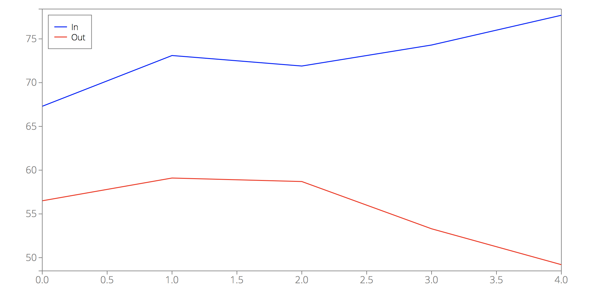
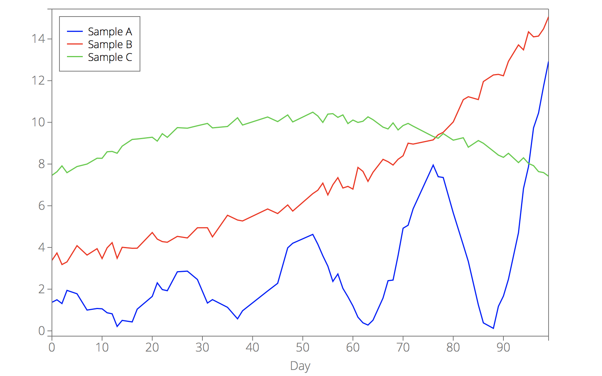

<em>

**Table of contents for [`d3lines.plot`](d3lines_plot.md)**

* [Data](d3lines_plot_data.md#plot_options_category_data) - options that define the data that you want to display.

    * [**`data`**](d3lines_plot_data.md#plot_option_data) - the data that you want to display.
    * [**`xkey`**](d3lines_plot_data.md#plot_option_xkey) - the name of the data field for the x-axis.

* [Lines](d3lines_plot_lines.md#plot_options_category_lines) - options that define the look and style of the lines or markers.

    * [**`line_color`**](d3lines_plot_lines.md#plot_option_line_color) - a color or an array of colors for the lines.
    * [**`line_width`**](d3lines_plot_lines.md#plot_option_line_width) - a width/thickness or an array of widths for the lines.
    * [**`line_style`**](d3lines_plot_lines.md#plot_option_line_style) - a style (solid, dotted, ...) or an array of styles for the lines.
    * [**`line_fill`**](d3lines_plot_lines.md#plot_option_line_fill) - a fill color or an array of fill colors for the areas under the lines.
    * [**`line_fill_opacity`**](d3lines_plot_lines.md#plot_option_line_fill_opacity) - a fill opacity or an array of fill opacities for the areas under the lines.
    * [**`line_interpolation`**](d3lines_plot_lines.md#plot_option_line_interpolation) - interpolation method the lines.
    * [**`marker`**](d3lines_plot_lines.md#plot_option_marker) - a marker/symbol or an array of markers for the lines.
    * [**`marker_fill`**](d3lines_plot_lines.md#plot_option_marker_fill) - a fill color or an array of fill colors for the markers.
    * [**`marker_fill_opacity`**](d3lines_plot_lines.md#plot_option_marker_fill_opacity) - a fill opacity or an array of fill opacities for the markers.
    * [**`marker_stroke_width`**](d3lines_plot_lines.md#plot_option_marker_stroke_width) - a width/thickness or an array of widths for the marker edges.
    * [**`marker_size`**](d3lines_plot_lines.md#plot_option_marker_size) - a size or an array of sizes for the markers.
    * [**`line_yaxis`**](d3lines_plot_lines.md#plot_option_line_yaxis) - specifies the y-axis (left or right) for the lines.
    * [**`plot_type`**](d3lines_plot_lines.md#plot_option_plot_type) - Line or scatter plot.

* [Geometry](d3lines_plot_geometry.md#plot_options_category_geometry) - Options related to the geometry of the plot.

    * [**`width`**](d3lines_plot_geometry.md#plot_option_width) - the width of the svg element.
    * [**`height`**](d3lines_plot_geometry.md#plot_option_height) - the height of the svg element.
    * [**`margins`**](d3lines_plot_geometry.md#plot_option_margins) - the margins between the edges of the svg element and the plotting area.

* [All axes](d3lines_plot_allaxes.md#plot_options_category_allaxes) - Options related to the look/style of all axes.

    * [**`box`**](d3lines_plot_allaxes.md#plot_option_box) - set to true (default) if you want a box drawn around the plotting area.
    * [**`axes_color`**](d3lines_plot_allaxes.md#plot_option_axes_color) - line color for the axes.
    * [**`axes_width`**](d3lines_plot_allaxes.md#plot_option_axes_width) - line width for the axes.
    * [**`axes_linestyle`**](d3lines_plot_allaxes.md#plot_option_axes_linestyle) - line style for the axes.
    * [**`axes_fill`**](d3lines_plot_allaxes.md#plot_option_axes_fill) - background color of the plotting area.
    * [**`axes_fill_opacity`**](d3lines_plot_allaxes.md#plot_option_axes_fill_opacity) - background opacity of the plotting area.
    * [**`axes_font_size`**](d3lines_plot_allaxes.md#plot_option_axes_font_size) - font size for the axes.
    * [**`axes_font_color`**](d3lines_plot_allaxes.md#plot_option_axes_font_color) - font color for the axes.
    * [**`axes_font_family`**](d3lines_plot_allaxes.md#plot_option_axes_font_family) - font family for the axes.

* [X-AXIS, Y-AXIS, Y2-AXIS](d3lines_plot_axis.md#plot_options_category_axes) - Options specific to one of the axes.

    * [**`xscale_type`**, **`yscale_type`**, **`y2scale_type`**](d3lines_plot_axis.md#plot_option_xscale_type) - scale type (linear, log or time) for the x-, y- or y2-axis.
    * [**`xlabel`**, **`ylabel`**, **`y2label`**](d3lines_plot_axis.md#plot_option_xlabel) - label for the x-, y- or y2-axis.
    * [**`xlabel_offset`**, **`ylabel_offset`**, **`y2label_offset`**](d3lines_plot_axis.md#plot_option_xlabel_offset) - label position offset for the x-, y- or y2-axis.
    * [**`xlim`**, **`ylim`**, **`y2lim`**](d3lines_plot_axis.md#plot_option_xlim) - limits for the x-, y- or y2-axis.
    * [**`xticks`**, **`yticks`**, **`y2ticks`**](d3lines_plot_axis.md#plot_option_xticks) - number of ticks for the x-, y- or y2-axis.
    * [**`xtick_format`**, **`ytick_format`**, **`y2tick_format`**](d3lines_plot_axis.md#plot_option_xtick_format) - tick-formatting for the x-, y- or y2-axis.
    * [**`xgrid`**, **`ygrid`**, **`y2grid`**](d3lines_plot_axis.md#plot_option_xgrid) - set to true if you want a grid for the x-, y- or y2-axis. Default value: false.
    * [**`xgrid_color`**, **`ygrid_color`**, **`y2grid_color`**](d3lines_plot_axis.md#plot_option_xgrid_color) - line color for the grid.
    * [**`xgrid_width`**, **`ygrid_width`**, **`y2grid_width`**](d3lines_plot_axis.md#plot_option_xgrid_width) - line width for the grid.
    * [**`xgrid_linestyle`**, **`ygrid_linestyle`**, **`y2grid_linestyle`**](d3lines_plot_axis.md#plot_option_xgrid_linestyle) - line style for the grid.

* [Legend](d3lines_plot_legend.md#plot_options_category_legend) - Options related to the chart legend.

    * [**`legend`**](d3lines_plot_legend.md#plot_option_legend) - set to true (default) if you want a legend.
    * [**`legend_position`**](d3lines_plot_legend.md#plot_option_legend_position) - legend position.
    * [**`legend_labels`**](d3lines_plot_legend.md#plot_option_legend_labels) - array of legend labels.
    * [**`legend_border_color`**](d3lines_plot_legend.md#plot_option_legend_border_color) - border color for the legend.
    * [**`legend_border_width`**](d3lines_plot_legend.md#plot_option_legend_border_width) - border width for the legend.
    * [**`legend_border_style`**](d3lines_plot_legend.md#plot_option_legend_border_style) - border style for the legend.
    * [**`legend_fill`**](d3lines_plot_legend.md#plot_option_legend_fill) - background color of the legend.
    * [**`legend_fill_opacity`**](d3lines_plot_legend.md#plot_option_legend_fill_opacity) - background opacity of the legend.
    * [**`legend_font_size`**](d3lines_plot_legend.md#plot_option_legend_font_size) - font size for the legend.
    * [**`legend_font_color`**](d3lines_plot_legend.md#plot_option_legend_font_color) - font color for the legend.
    * [**`legend_font_family`**](d3lines_plot_legend.md#plot_option_legend_font_family) - font family for the legend.

* [Interactivity](d3lines_plot_interactive.md#plot_options_category_interactivity) - Options related to the interactivity of the plot.

    * [**`interactive`**](d3lines_plot_interactive.md#plot_option_interactive) - set to true (default) if you want an interactive plot.
    * [**`interactive_options`**](d3lines_plot_interactive.md#plot_option_interactive_options) - dictionary of interactive options.
        * [**`snap_axis`**](d3lines_plot_interactive.md#plot_option_interactive_snap_axis) - which axis should your mouse snap to.
        * [**`line`**](d3lines_plot_interactive.md#plot_option_interactive_line) - set to true (default) if you want an interactive line when hovering over the plot.
        * [**`line_color`**](d3lines_plot_interactive.md#plot_option_interactive_line_color) - color of the interactive line.
        * [**`line_width`**](d3lines_plot_interactive.md#plot_option_interactive_line_width) - width of the interactive line.
        * [**`line_style`**](d3lines_plot_interactive.md#plot_option_interactive_line_style) - style of the interactive line.
        * [**`dots`**](d3lines_plot_interactive.md#plot_option_interactive_dots) - set to true (default) if you want dots corresponding to your data when hovering over the plot.
        * [**`dot_radius`**](d3lines_plot_interactive.md#plot_option_interactive_dot_radius) - radius of the dots.
        * [**`textbox`**](d3lines_plot_interactive.md#plot_option_interactive_textbox) - set to true (default) if you want a textbox with data information when hovering over the plot.
        * [**`box_border_color`**](d3lines_plot_interactive.md#plot_option_box_border_color) - border color for the textbox.
        * [**`box_border_width`**](d3lines_plot_interactive.md#plot_option_box_border_width) - border width for the textbox.
        * [**`box_border_style`**](d3lines_plot_interactive.md#plot_option_box_border_style) - border style for the textbox.
        * [**`box_fill`**](d3lines_plot_interactive.md#plot_option_interactive_box_fill) - background color of the textbox.
        * [**`box_fill_opacity`**](d3lines_plot_interactive.md#plot_option_interactive_box_fill_opacity) - background opacity of the textbox.
        * [**`box_padding`**](d3lines_plot_interactive.md#plot_option_interactive_box_padding) - padding between the border of the box and the text.
        * [**`font_size`**](d3lines_plot_interactive.md#plot_option_interactive_font_size) - font size for the textbox.
        * [**`font_color`**](d3lines_plot_interactive.md#plot_option_interactive_font_color) - font color for the textbox.
        * [**`font_family`**](d3lines_plot_interactive.md#plot_option_interactive_font_family) - font family for the textbox.
        * [**`output_string`**](d3lines_plot_interactive.md#plot_option_interactive_output_string) - specifies the text that you want to write in the text box.
        * [**`zoom`**](d3lines_plot_interactive.md#plot_option_interactive_zoom) - set to true (default) if you want zooming to be enabled.
        
</em>  

----

#### <a name="plot_options_category_data"></a>Data options

These options will allow you to define the data that you want to plot.

----

<!-- DATA -->
<a name="plot_option_data"></a> **`data`** - the data that you want to display.

`d3lines.plot` accepts several data types:

1. An array of dictionaries

Example (see [this jsfiddle](https://jsfiddle.net/frenetic_be/s138xcnv/)):

```javascript
var data = [{In: 67.3, Out: 56.5},
            {In: 73.1, Out: 59.1},
            {In: 71.9, Out: 58.7},
            {In: 74.3, Out: 53.3},
            {In: 77.7, Out: 49.2}];

var options = {
    data: data,
};

d3lines.plot(svg, options);
```

<p align="center"></p>

This is the basic supported data type. It is the data type coming out of the [D3 csv, tsv and dsv](https://github.com/d3/d3-3.x-api-reference/blob/master/CSV.md) parsers.

For example, the data above can be obtained by parsing the following `example.csv` file:

```
In,Out
67.3,56.5
73.1,59.1
71.9,58.7
74.3,53.3
77.7,49.2
```

The example above then becomes:

```javascript
d3.csv("example.csv", function(error, data) {
    var options = {
        data: data,
    };
    d3lines.plot(svg, options);
});
```

2. A dictionary of arrays

Example:

```js
var data = {In: [67.3, 73.1, 71.9, 74.3, 77.7],
            Out: [56.5, 59.1, 58.7, 53.3, 49.2]};
```

`d3lines.plot` will attempt to transform this data into the standard array of dictionaries.

3. An array (or an array of arrays)

Example:

```js
var data = [[67.3, 56.5],
            [73.1, 59.1],
            [71.9, 58.7],
            [74.3, 53.3],
            [77.7, 49.2]];
```

`d3lines.plot` will attempt to transform this data into the standard array of dictionaries. Since there are no keys or field names in this array. `d3lines.plot` will simply name them `y1`, `y2`, ...

4. An instance of `d3lines.Data`

See [`d3lines.Data`](d3lines_Data.md#Data) for details.

----

<!-- XKEY -->
<a name="plot_option_xkey"></a>**`xkey`** - the name of the data field for the x-axis. `xkey` should be the name of an existing key/field in your data (or existing column in your `.csv` file).

Suppose that you have the following `example2.csv`:

```
Day,Sample A,Sample B,Sample C
0,1.36978893471,3.38066609811,7.45844794384
1,1.49137655531,3.73562084117,7.63119347755
2,1.31017647221,3.18068192911,7.91360793457
3,1.94220556984,3.3077832707,7.58647498067
5,1.77968604686,4.08654857579,7.88098220595
7,0.997654022027,3.63538096353,8.00060374422
9,1.0733420551,3.94260109575,8.27977747233
10,1.05827381601,3.4675124496,8.27592568438
11,0.868382926097,3.98204649432,8.5884383334
12,0.81904420459,4.23153801748,8.60615909873
13,0.211346950485,3.48159582174,8.51885166262
14,0.502426110935,4.00882731717,8.85955705304
16,0.428451632712,3.96117944976,9.18180366264
17,1.04163792553,3.96417664929,9.20189324965
20,1.65277501927,4.71706610312,9.28660800814
21,2.30355686489,4.40055478386,9.10005351925
22,1.98011642352,4.28127578006,9.45732390058
23,1.92578819133,4.24988962377,9.2813438626
25,2.83355771364,4.531977732,9.74802805888
27,2.86510553,4.45628993545,9.72014913369
29,2.46391268367,4.94468815819,9.83643787802
31,1.33390118878,4.94602962698,9.94864620082
32,1.49865153895,4.5081845264,9.73482618335
35,1.12928356976,5.54484986623,9.80230835739
37,0.577915325874,5.3160935591,10.2208536926
38,0.963887752359,5.27097249312,9.87139312408
43,1.91308864095,5.84662048942,10.2575789957
45,2.28138866381,5.62614589185,10.0362131626
47,3.98233556726,6.03960751819,10.3564396765
48,4.20154102933,5.74450477186,10.0201650906
52,4.62734034229,6.58126399348,10.4879707942
53,4.1583600623,6.74476162006,10.3062670141
54,3.60289368004,7.08549438007,9.99730862968
55,3.10613029358,6.51947130176,10.3953371742
56,2.37063599917,7.00610102317,10.4167041786
57,2.72980165959,7.34890058783,10.2393033322
58,2.03934690879,6.85086377411,10.3584094022
59,1.63679377172,6.9296261582,9.94050716439
60,1.19564798487,6.79853084373,10.1114271712
61,0.655471774952,7.83847602017,9.99690581442
62,0.385796680674,7.64894687909,10.0531244406
63,0.278324384613,7.16921707316,10.2653275541
64,0.51113849592,7.604307368,10.1286850174
66,1.57461405987,8.2262377036,9.77114841935
67,2.40624734565,8.11356524606,9.68408544648
68,2.43529684566,7.95256231606,9.97495804536
69,3.61332159008,8.22750328326,9.63678093146
70,4.92327747654,8.39838248123,9.84821794504
71,5.06532411968,9.00167080446,9.94965846792
72,5.85338666451,8.9578441662,9.81770910251
76,7.95126311533,9.15882518405,9.320794114
77,7.39387324551,9.40653560907,9.23932850863
78,7.3560307929,9.52281438728,9.46205751247
80,5.65850626333,10.0206385502,9.14498445324
82,4.11375029892,11.088206372,9.26279650048
83,3.33141152116,11.2291596108,8.80828285438
85,1.24794738328,11.0923759382,9.1272399739
86,0.383933826093,11.9565979759,8.99766245759
88,0.12056697819,12.2736856997,8.62030045971
89,1.17790151531,12.3018139038,8.42843589536
90,1.6695839921,12.2338390187,8.32240562087
91,2.47604417627,12.9268026429,8.51609928178
93,4.70595987669,13.7153127875,8.06990380397
94,6.82692246401,13.4768857118,8.30022925411
95,7.87689619998,14.3432131529,8.02836320274
96,9.73399572755,14.1008412337,7.92389526433
97,10.4488214849,14.1375429697,7.63726835332
98,11.7286960169,14.4860340892,7.59136934731
99,12.9190593149,15.0618799918,7.41576150465
```

In this case, there are four columns and four possible `xkey` values (`"Day"`, `"Sample A"`, `"Sample B"` or `"Sample C"`). For example (see [this jsfiddle](https://jsfiddle.net/frenetic_be/ok3vyzhb/)):

```javascript
d3.csv("example2.csv", function(error, data) {
    var options = {
        data: data,
        xkey: "Day"
    };
    d3lines.plot(svg, options);
});
```

<p align="center"></p>
