<em>

**Table of contents for [``d3lines.plot``](d3lines_plot.md)**

* [Data](d3lines_plot_data.md#plot_options_category_data) - options that define the data that you want to display.

    * [**`data`**](d3lines_plot_data.md#plot_option_data) - the data that you want to display.
    * [**`xkey`**](d3lines_plot_data.md#plot_option_xkey) - the name of the data field for the x-axis.

* [Lines](d3lines_plot_lines.md#plot_options_category_lines) - options that define the look and style of the lines or markers.

    * [**`line_color`**](d3lines_plot_lines.md#plot_option_line_color) - a color or an array of colors for the lines.
    * [**`line_width`**](d3lines_plot_lines.md#plot_option_line_width) - a width/thickness or an array of widths for the lines.
    * [**`line_style`**](d3lines_plot_lines.md#plot_option_line_style) - a style (solid, dotted, ...) or an array of styles for the lines.
    * [**`line_fill`**](d3lines_plot_lines.md#plot_option_line_fill) - a fill color or an array of fill colors for the areas under the lines.
    * [**`line_fill_opacity`**](d3lines_plot_lines.md#plot_option_line_fill_opacity) - a fill opacity or an array of fill opacities for the areas under the lines.
    * [**`marker`**](d3lines_plot_lines.md#plot_option_marker) - a marker/symbol or an array of markers for the lines.
    * [**`marker_fill`**](d3lines_plot_lines.md#plot_option_marker_fill) - a fill color or an array of fill colors for the markers.
    * [**`marker_fill_opacity`**](d3lines_plot_lines.md#plot_option_marker_fill_opacity) - a fill opacity or an array of fill opacities for the markers.
    * [**`marker_stroke_width`**](d3lines_plot_lines.md#plot_option_marker_stroke_width) - a width/thickness or an array of widths for the marker edges.
    * [**`marker_size`**](d3lines_plot_lines.md#plot_option_marker_size) - a size or an array of sizes for the markers.
    * [**`line_yaxis`**](d3lines_plot_lines.md#plot_option_line_yaxis) - specifies the y-axis (left or right) for the lines.
    * [**`plot_type`**](d3lines_plot_lines.md#plot_option_plot_type) - Line or scatter plot.

* [Geometry](d3lines_plot_geometry.md#plot_options_category_geometry) - Options related to the geometry of the plot.

    * [**`width`**](d3lines_plot_geometry.md#plot_option_width) - the width of the svg element.
    * [**`height`**](d3lines_plot_geometry.md#plot_option_height) - the height of the svg element.
    * [**`margins`**](d3lines_plot_geometry.md#plot_option_margins) - the margins between the edges of the svg element and the plotting area.

* [All axes](d3lines_plot_allaxes.md#plot_options_category_allaxes) - Options related to the look/style of all axes.

    * [**`box`**](d3lines_plot_allaxes.md#plot_option_box) - set to true (default) if you want a box drawn around the plotting area.
    * [**`axes_color`**](d3lines_plot_allaxes.md#plot_option_axes_color) - line color for the axes.
    * [**`axes_width`**](d3lines_plot_allaxes.md#plot_option_axes_width) - line width for the axes.
    * [**`axes_linestyle`**](d3lines_plot_allaxes.md#plot_option_axes_linestyle) - line style for the axes.
    * [**`axes_fill`**](d3lines_plot_allaxes.md#plot_option_axes_fill) - background color of the plotting area.
    * [**`axes_fill_opacity`**](d3lines_plot_allaxes.md#plot_option_axes_fill_opacity) - background opacity of the plotting area.
    * [**`axes_font_size`**](d3lines_plot_allaxes.md#plot_option_axes_font_size) - font size for the axes.
    * [**`axes_font_color`**](d3lines_plot_allaxes.md#plot_option_axes_font_color) - font color for the axes.
    * [**`axes_font_family`**](d3lines_plot_allaxes.md#plot_option_axes_font_family) - font family for the axes.

* [X-AXIS, Y-AXIS, Y2-AXIS](d3lines_plot_axis.md#plot_options_category_axes) - Options specific to one of the axes.

    * [**`xscale_type`**, **`yscale_type`**, **`y2scale_type`**](d3lines_plot_axis.md#plot_option_xscale_type) - scale type (linear, log or time) for the x-, y- or y2-axis.
    * [**`xlabel`**, **`ylabel`**, **`y2label`**](d3lines_plot_axis.md#plot_option_xlabel) - label for the x-, y- or y2-axis.
    * [**`xlabel_offset`**, **`ylabel_offset`**, **`y2label_offset`**](d3lines_plot_axis.md#plot_option_xlabel_offset) - label position offset for the x-, y- or y2-axis.
    * [**`xlim`**, **`ylim`**, **`y2lim`**](d3lines_plot_axis.md#plot_option_xlim) - limits for the x-, y- or y2-axis.
    * [**`xticks`**, **`yticks`**, **`y2ticks`**](d3lines_plot_axis.md#plot_option_xticks) - number of ticks for the x-, y- or y2-axis.
    * [**`xtick_format`**, **`ytick_format`**, **`y2tick_format`**](d3lines_plot_axis.md#plot_option_xtick_format) - tick-formatting for the x-, y- or y2-axis.
    * [**`xgrid`**, **`ygrid`**, **`y2grid`**](d3lines_plot_axis.md#plot_option_xgrid) - set to true if you want a grid for the x-, y- or y2-axis. Default value: false.
    * [**`xgrid_color`**, **`ygrid_color`**, **`y2grid_color`**](d3lines_plot_axis.md#plot_option_xgrid_color) - line color for the grid.
    * [**`xgrid_width`**, **`ygrid_width`**, **`y2grid_width`**](d3lines_plot_axis.md#plot_option_xgrid_width) - line width for the grid.
    * [**`xgrid_linestyle`**, **`ygrid_linestyle`**, **`y2grid_linestyle`**](d3lines_plot_axis.md#plot_option_xgrid_linestyle) - line style for the grid.

* [Legend](d3lines_plot_legend.md#plot_options_category_legend) - Options related to the chart legend.

    * [**`legend`**](d3lines_plot_legend.md#plot_option_legend) - set to true (default) if you want a legend.
    * [**`legend_position`**](d3lines_plot_legend.md#plot_option_legend_position) - legend position.
    * [**`legend_labels`**](d3lines_plot_legend.md#plot_option_legend_labels) - array of legend labels.
    * [**`legend_border_color`**](d3lines_plot_legend.md#plot_option_legend_border_color) - border color for the legend.
    * [**`legend_border_width`**](d3lines_plot_legend.md#plot_option_legend_border_width) - border width for the legend.
    * [**`legend_border_style`**](d3lines_plot_legend.md#plot_option_legend_border_style) - border style for the legend.
    * [**`legend_fill`**](d3lines_plot_legend.md#plot_option_legend_fill) - background color of the legend.
    * [**`legend_fill_opacity`**](d3lines_plot_legend.md#plot_option_legend_fill_opacity) - background opacity of the legend.
    * [**`legend_font_size`**](d3lines_plot_legend.md#plot_option_legend_font_size) - font size for the legend.
    * [**`legend_font_color`**](d3lines_plot_legend.md#plot_option_legend_font_color) - font color for the legend.
    * [**`legend_font_family`**](d3lines_plot_legend.md#plot_option_legend_font_family) - font family for the legend.

* [Interactivity](d3lines_plot_interactive.md#plot_options_category_interactivity) - Options related to the interactivity of the plot.

    * [**`interactive`**](d3lines_plot_interactive.md#plot_option_interactive) - set to true (default) if you want an interactive plot.
    * [**`interactive_options`**](d3lines_plot_interactive.md#plot_option_interactive_options) - dictionary of interactive options.
        * [**`snap_axis`**](d3lines_plot_interactive.md#plot_option_interactive_snap_axis) - which axis should your mouse snap to.
        * [**`line`**](d3lines_plot_interactive.md#plot_option_interactive_line) - set to true (default) if you want an interactive line when hovering over the plot.
        * [**`line_color`**](d3lines_plot_interactive.md#plot_option_interactive_line_color) - color of the interactive line.
        * [**`line_width`**](d3lines_plot_interactive.md#plot_option_interactive_line_width) - width of the interactive line.
        * [**`line_style`**](d3lines_plot_interactive.md#plot_option_interactive_line_style) - style of the interactive line.
        * [**`dots`**](d3lines_plot_interactive.md#plot_option_interactive_dots) - set to true (default) if you want dots corresponding to your data when hovering over the plot.
        * [**`dot_radius`**](d3lines_plot_interactive.md#plot_option_interactive_dot_radius) - radius of the dots.
        * [**`textbox`**](d3lines_plot_interactive.md#plot_option_interactive_textbox) - set to true (default) if you want a textbox with data information when hovering over the plot.
        * [**`box_fill`**](d3lines_plot_interactive.md#plot_option_interactive_box_fill) - background color of the textbox.
        * [**`box_fill_opacity`**](d3lines_plot_interactive.md#plot_option_interactive_box_fill_opacity) - background opacity of the textbox.
        * [**`box_padding`**](d3lines_plot_interactive.md#plot_option_interactive_box_padding) - padding between the border of the box and the text.
        * [**`font_size`**](d3lines_plot_interactive.md#plot_option_interactive_font_size) - font size for the textbox.
        * [**`font_color`**](d3lines_plot_interactive.md#plot_option_interactive_font_color) - font color for the textbox.
        * [**`font_family`**](d3lines_plot_interactive.md#plot_option_interactive_font_family) - font family for the textbox.
        * [**`output_string`**](d3lines_plot_interactive.md#plot_option_interactive_output_string) - specifies the text that you want to write in the text box.
        * [**`zoom`**](d3lines_plot_interactive.md#plot_option_interactive_zoom) - set to true (default) if you want zooming to be enabled.
        
</em>  

----

#### <a name="plot_options_category_interactivity"></a>Interactivity options

With these options, you can customize the interactive behavior of your chart.
By default, your chart is interactive: this means that the following features are enabled:

- When hovering over your chart, you will see:
    - a vertical line and/or a horizontal line, that snaps to your data along one axis or both axes,
    - a series of colored dots along the line that snaps to your data,
    - a text box with data information at the dot locations.

- zooming/panning is enabled.

All of these features can be turned on or off and everything is customizable using the following options.

```javascript
d3.csv("example2.csv", function(error, data) {
    var options = {
        data: data,
        xkey: "Day",
    };
    d3lines.plot(svg, options);
});
```

By default, here is how it looks when hovering over your chart:

<p align="center">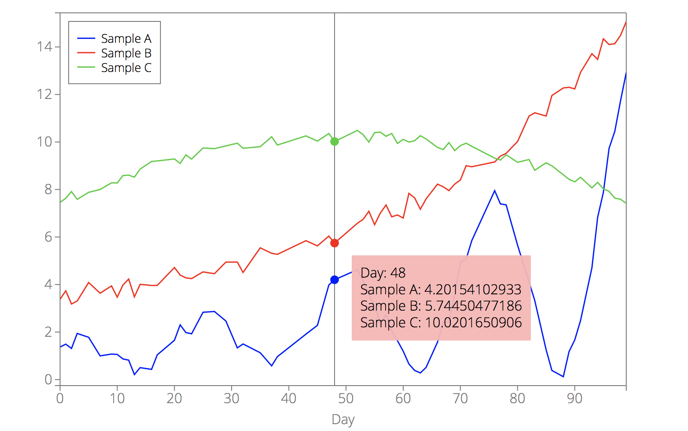</p>

----

<!-- interactive -->
<a name="plot_option_interactive"></a>**`interactive`** - set to true (default) if you want an interactive plot.
Set this option to false to turn off all interactive behavior (including zooming/panning).

----

<!-- interactive_options -->
<a name="plot_option_interactive_options"></a>**`interactive_options`** - dictionary of interactive options.
All options related to the interactive behavior are defined in `interactive_options`.
`interactive_options` must be an object with the following optional keys:

* [**`snap_axis`**](d3lines_plot_interactive.md#plot_option_interactive_snap_axis) - which axis should your mouse snap to.
* [**`line`**](d3lines_plot_interactive.md#plot_option_interactive_line) - set to true (default) if you want an interactive line when hovering over the plot.
* [**`line_color`**](d3lines_plot_interactive.md#plot_option_interactive_line_color) - color of the interactive line.
* [**`line_width`**](d3lines_plot_interactive.md#plot_option_interactive_line_width) - width of the interactive line.
* [**`line_style`**](d3lines_plot_interactive.md#plot_option_interactive_line_style) - style of the interactive line.
* [**`dots`**](d3lines_plot_interactive.md#plot_option_interactive_dots) - set to true (default) if you want dots corresponding to your data when hovering over the plot.
* [**`dot_radius`**](d3lines_plot_interactive.md#plot_option_interactive_dot_radius) - radius of the dots.
* [**`textbox`**](d3lines_plot_interactive.md#plot_option_interactive_textbox) - set to true (default) if you want a textbox with data information when hovering over the plot.
* [**`box_fill`**](d3lines_plot_interactive.md#plot_option_interactive_box_fill) - background color of the textbox.
* [**`box_fill_opacity`**](d3lines_plot_interactive.md#plot_option_interactive_box_fill_opacity) - background opacity of the textbox.
* [**`box_padding`**](d3lines_plot_interactive.md#plot_option_interactive_box_padding) - padding between the border of the box and the text.
* [**`font_size`**](d3lines_plot_interactive.md#plot_option_interactive_font_size) - font size for the textbox.
* [**`font_color`**](d3lines_plot_interactive.md#plot_option_interactive_font_color) - font color for the textbox.
* [**`font_family`**](d3lines_plot_interactive.md#plot_option_interactive_font_family) - font family for the textbox.
* [**`output_string`**](d3lines_plot_interactive.md#plot_option_interactive_output_string) - specifies the text that you want to write in the text box.
* [**`zoom`**](d3lines_plot_interactive.md#plot_option_interactive_zoom) - set to true (default) if you want zooming to be enabled.

By default,

```javascript
interactive_options = {
    snap_axis: "x",

    line: true,
    line_style: "-",
    line_width: 1,
    line_color: "#777",

    dots: true,
    dot_radius: 5,

    textbox: true,
    box_fill: "#ffb4b4",
    box_padding: 10,
    box_fill_opacity: 0.95,
    font_size: "1em",
    font_color: "black",
    font_family: "",

    output_string: function(pt){
        var arr = [];
        Object.keys(pt).forEach(function(key, index){
            arr.push(key+": "+pt[key]);
        });
        return arr.join("<br>");
    },

    zoom: true,
};
```

----

<!-- snap_axis -->
<a name="plot_option_interactive_snap_axis"></a>**`snap_axis`** - which axis should your mouse snap to when hovering over your data.
By default, `snap_axis = x`.

Possible values:

- "x",
- "y",
- "both".

```javascript
d3.csv("example2.csv", function(error, data) {
    var options = {
        data: data,
        xkey: "Day",
        interactive_options: {
            snap_axis: "both",
        }
    };
    d3lines.plot(svg, options);
});
```

<p align="center">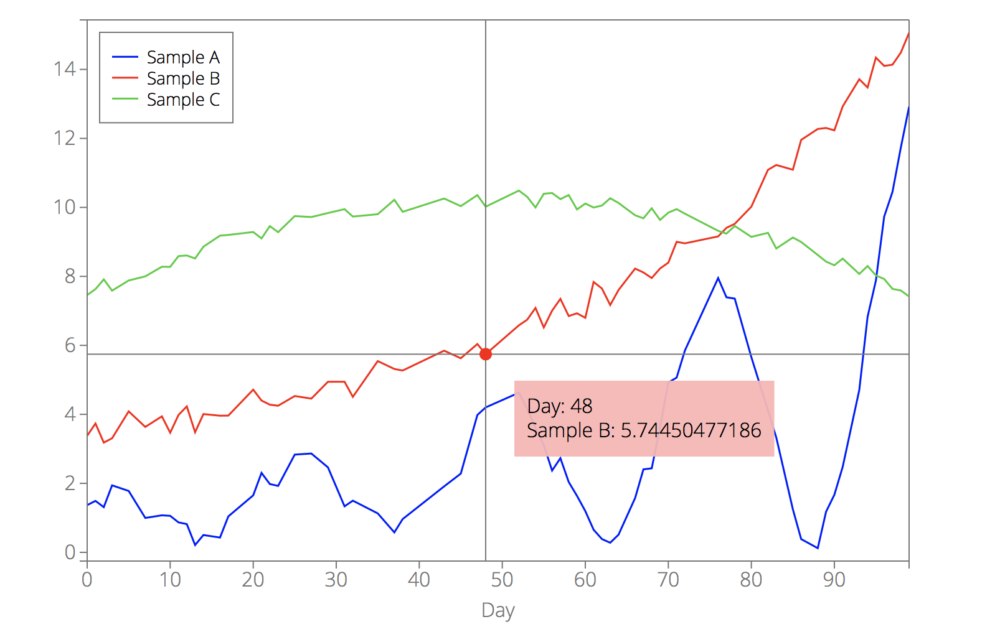</p>

----

<!-- line -->
<a name="plot_option_interactive_line"></a>**`line`** - set to true (default) if you want an interactive line when hovering over the plot and to false otherwise.

```javascript
d3.csv("example2.csv", function(error, data) {
    var options = {
        data: data,
        xkey: "Day",
        interactive_options: {
            line: false,
        }
    };
    d3lines.plot(svg, options);
});
```

<p align="center">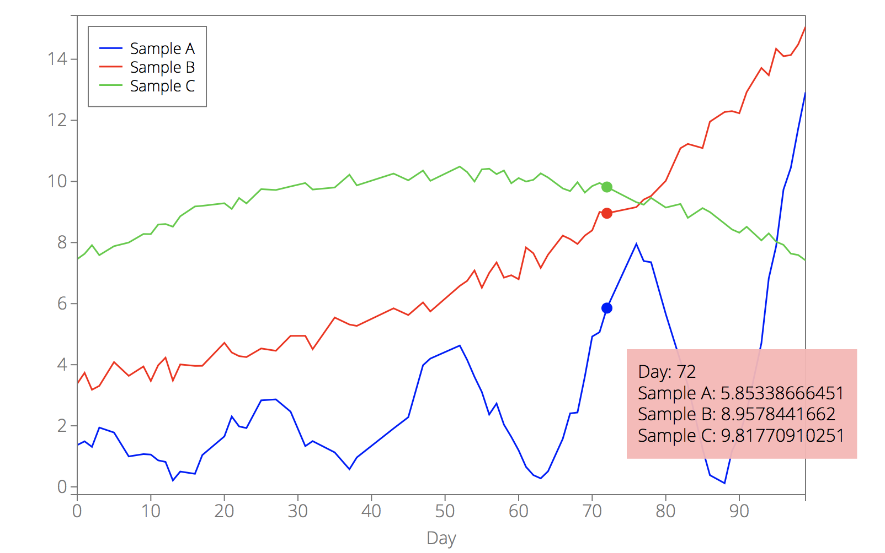</p>

----

<!-- line_color -->
<a name="plot_option_interactive_line_color"></a>**`line_color`** - color of the interactive line.
<!-- line_width -->
<a name="plot_option_interactive_line_width"></a>**`line_width`** - width of the interactive line.
<!-- line_style -->
<a name="plot_option_interactive_line_style"></a>**`line_style`** - style of the interactive line.

By default, `line_color = "#777"`, `line_style: "-"` and `line_width: 1`.

See [**`line_color`**](d3lines_plot_lines.md#plot_option_line_color) for color options.

See [**`line_style`**](d3lines_plot_lines.md#plot_option_line_style) for style options.

```javascript
d3.csv("example2.csv", function(error, data) {
    var options = {
        data: data,
        xkey: "Day",
        interactive_options: {
            line_color: "red",
            line_style: "dashed",
            line_width: 2,
        }
    };
    d3lines.plot(svg, options);
});
```

<p align="center">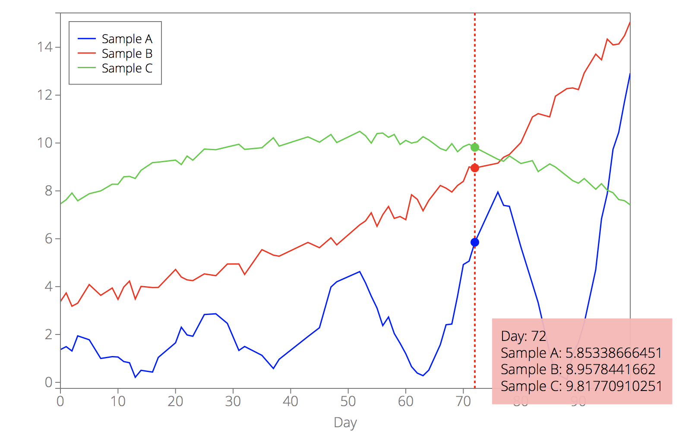</p>

----

<!-- dots -->
<a name="plot_option_interactive_dots"></a>**`dots`** - set to true (default) if you want dots corresponding to your data when hovering over the plot and to false otherwise.

```javascript
d3.csv("example2.csv", function(error, data) {
    var options = {
        data: data,
        xkey: "Day",
        interactive_options: {
            dots: false,
        }
    };
    d3lines.plot(svg, options);
});
```

<p align="center">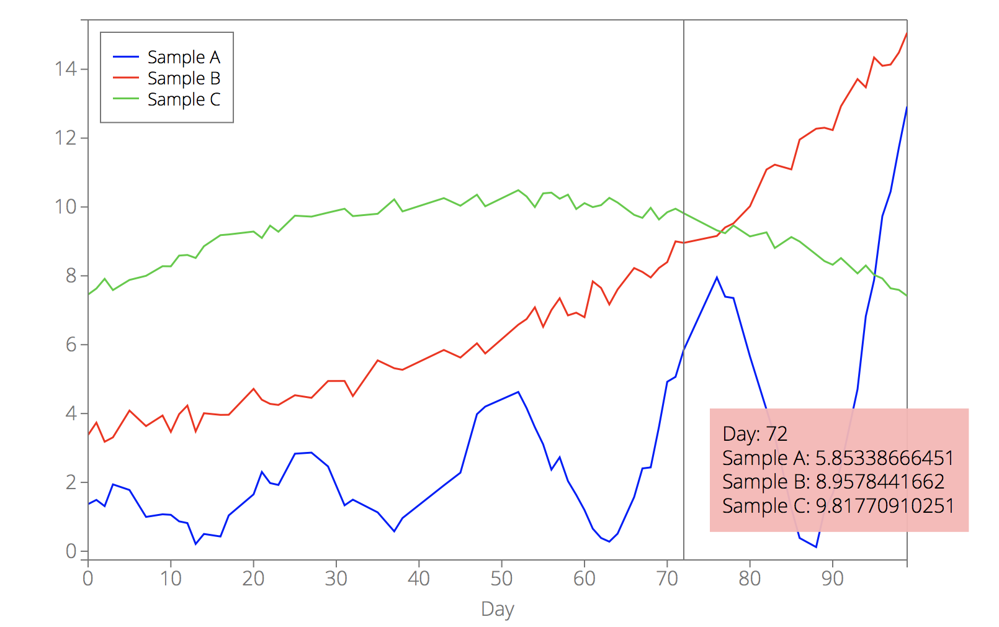</p>

----

<!-- dot_radius -->
<a name="plot_option_interactive_dot_radius"></a>**`dot_radius`** - radius of the dots.
By default, `dot_radius = 5`.

```javascript
d3.csv("example2.csv", function(error, data) {
    var options = {
        data: data,
        xkey: "Day",
        interactive_options: {
            dot_radius: 10,
        }
    };
    d3lines.plot(svg, options);
});
```

<p align="center">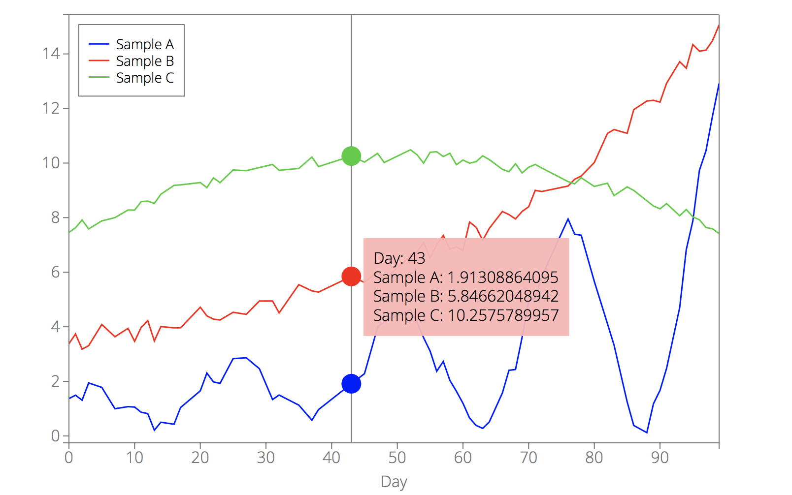</p>

----

<!-- textbox -->
<a name="plot_option_interactive_textbox"></a>**`textbox`** - set to true (default) if you want a textbox with data information when hovering over the plot.

```javascript
d3.csv("example2.csv", function(error, data) {
    var options = {
        data: data,
        xkey: "Day",
        interactive_options: {
            textbox: false,
        }
    };
    d3lines.plot(svg, options);
});
```

<p align="center">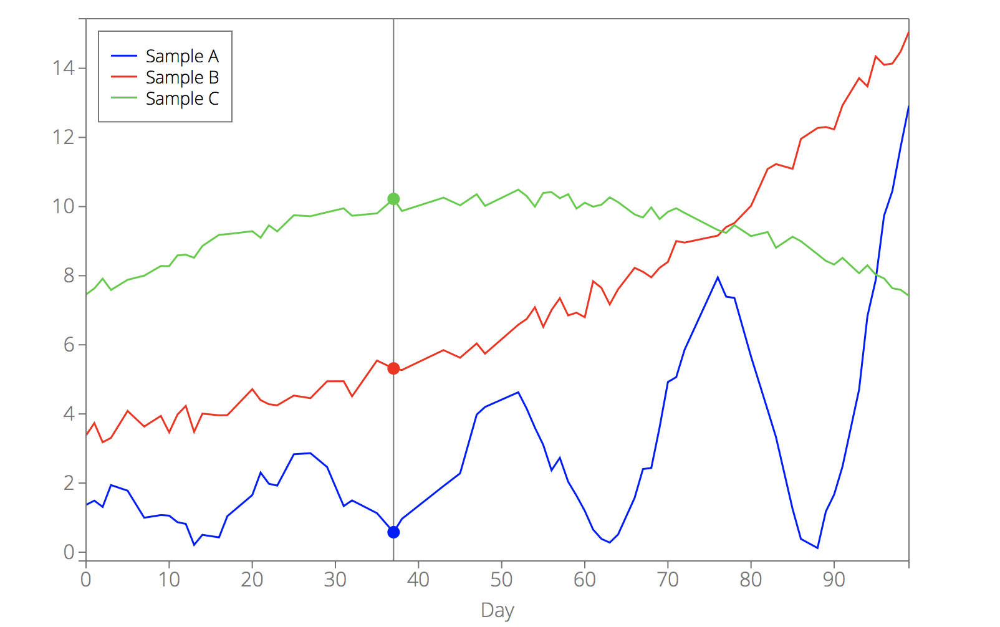</p>

----

<!-- box_fill -->
<a name="plot_option_interactive_box_fill"></a>**`box_fill`** - background color of the textbox.
By default, `box_fill = "#ffb4b4"`.

See [**`line_color`**](d3lines_plot_lines.md#plot_option_line_color) for color options.

```javascript
d3.csv("example2.csv", function(error, data) {
    var options = {
        data: data,
        xkey: "Day",
        interactive_options: {
            box_fill: "lightsteelblue",
        }
    };
    d3lines.plot(svg, options);
});
```

<p align="center">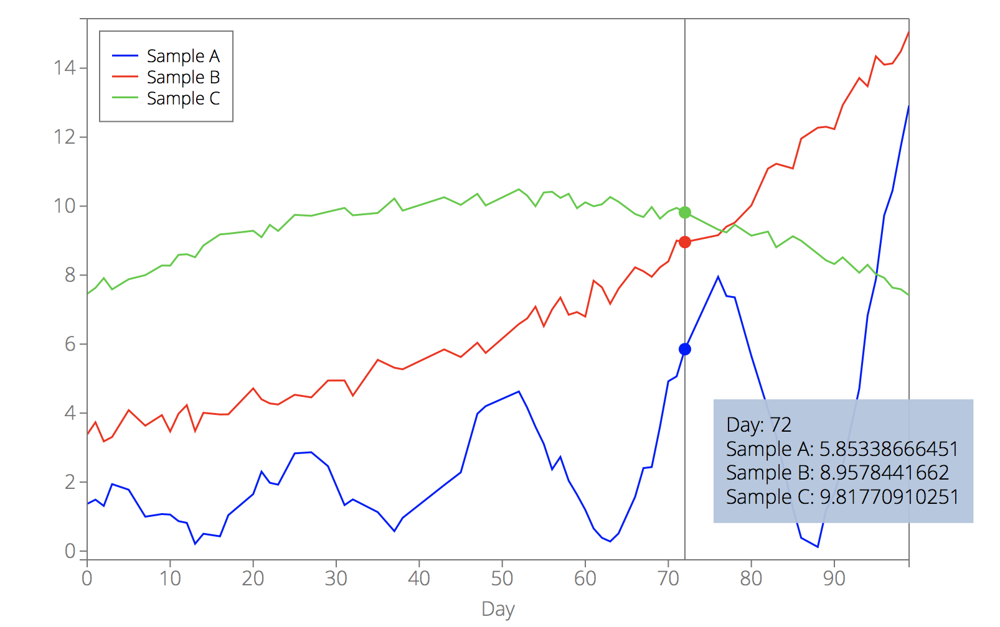</p>

----

<!-- box_fill_opacity -->
<a name="plot_option_interactive_box_fill_opacity"></a>**`box_fill_opacity`** - background opacity of the textbox.
By default, `box_fill_opacity = 0.95`.

```javascript
d3.csv("example2.csv", function(error, data) {
    var options = {
        data: data,
        xkey: "Day",
        interactive_options: {
            box_fill: "limegreen",
            box_fill_opacity: 0.5
        }
    };
    d3lines.plot(svg, options);
});
```

<p align="center">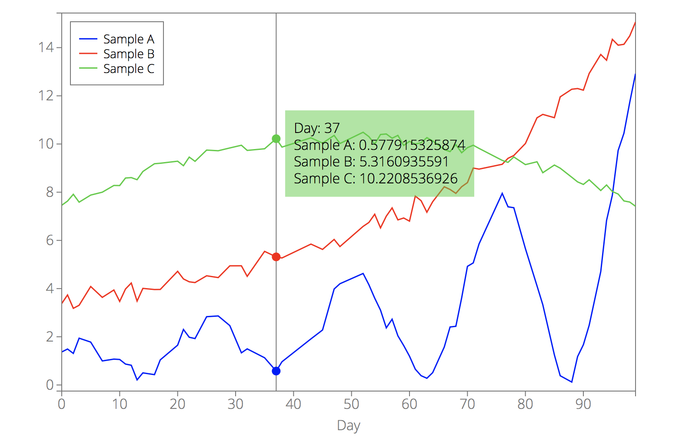</p>

----

<!-- box_padding -->
<a name="plot_option_interactive_box_padding"></a>**`box_padding`** - padding between the border of the box and the text.
By default, `box_padding = 10`.

```javascript
d3.csv("example2.csv", function(error, data) {
    var options = {
        data: data,
        xkey: "Day",
        interactive_options: {
            box_padding: 50,
        }
    };
    d3lines.plot(svg, options);
});
```

<p align="center">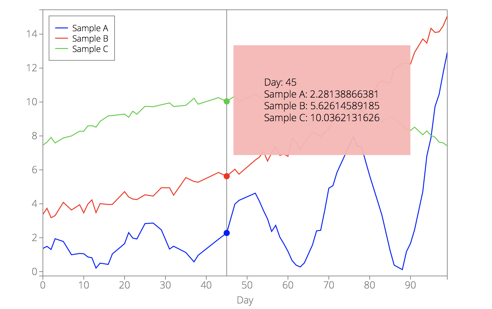</p>


----

<!-- font_size -->
<a name="plot_option_interactive_font_size"></a>**`font_size`** - font size for the textbox.
<!-- font_color -->
<a name="plot_option_interactive_font_color"></a>**`font_color`** - font color for the textbox.
<!-- font_family -->
<a name="plot_option_interactive_font_family"></a>**`font_family`** - font family for the textbox.

See [**`line_color`**](d3lines_plot_lines.md#plot_option_line_color) for color options.

```javascript
d3.csv("example2.csv", function(error, data) {
    var options = {
        data: data,
        xkey: "Day",
        interactive_options: {
            box_fill: "steelblue",
            font_size: "2em",
            font_color: "white",
            font_family: "Palatino",
        }
    };
    d3lines.plot(svg, options);
});
```

<p align="center">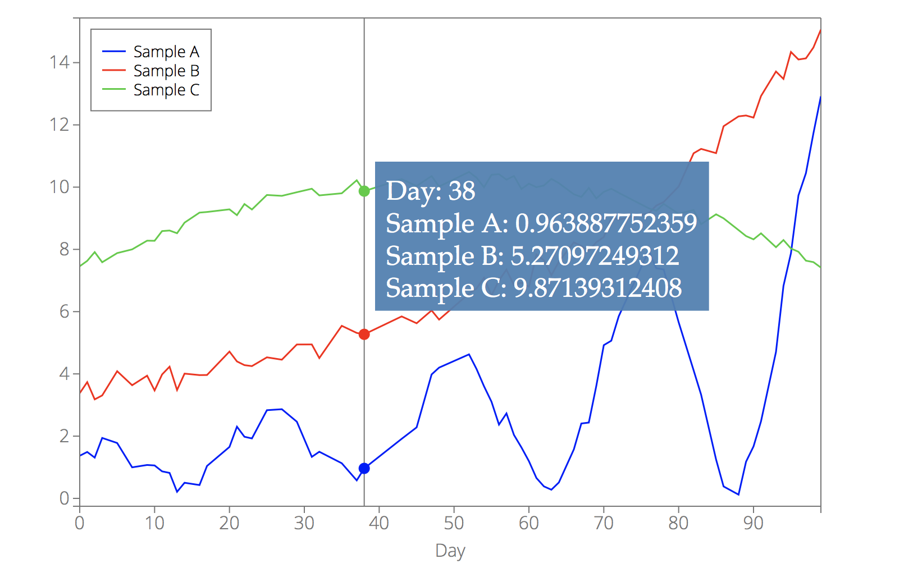</p>

----

<!-- output_string -->
<a name="plot_option_interactive_output_string"></a>**`output_string`** - specifies the text that you want to write in the text box.
`output_string` should be a function that transform a data object into a string.

For example (default value):
```javascript
output_string: function(pt){
    var arr = [];
    Object.keys(pt).forEach(function(key, index){
        arr.push(key+": "+pt[key]);
    });
    return arr.join("<br>");
}
```

In this example, a string representation of all key-value pairs in the data object.

Here is another example,
```javascript
d3.csv("example2.csv", function(error, data) {
    var options = {
        data: data,
        xkey: "Day",
        interactive_options: {
            output_string: function(pt){
                if (pt.hasOwnProperty("Day")) return "Day: "+pt.Day+"/99";
                return "Sorry, I can't tell which day it is";
            }
        }
    };
    d3lines.plot(svg, options);
});
```

<p align="center">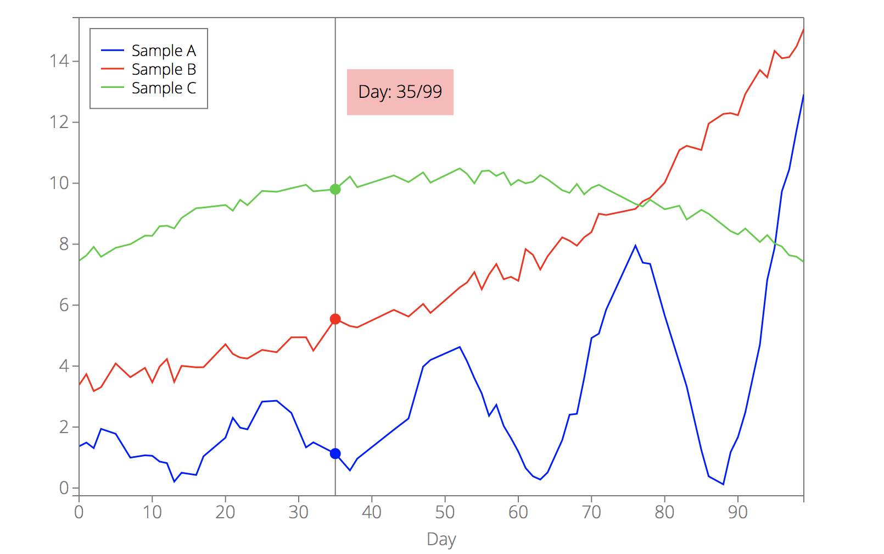</p>

----

<!-- zoom -->
<a name="plot_option_interactive_zoom"></a>**`zoom`** - set to true (default) if you want zooming/panning to be enabled and to false otherwise.
Click-and-drag to pan, spin the wheel or double-tap to zoom. See [d3.zoom](https://github.com/d3/d3-zoom#api-reference) to see how native events are interpreted.

----
