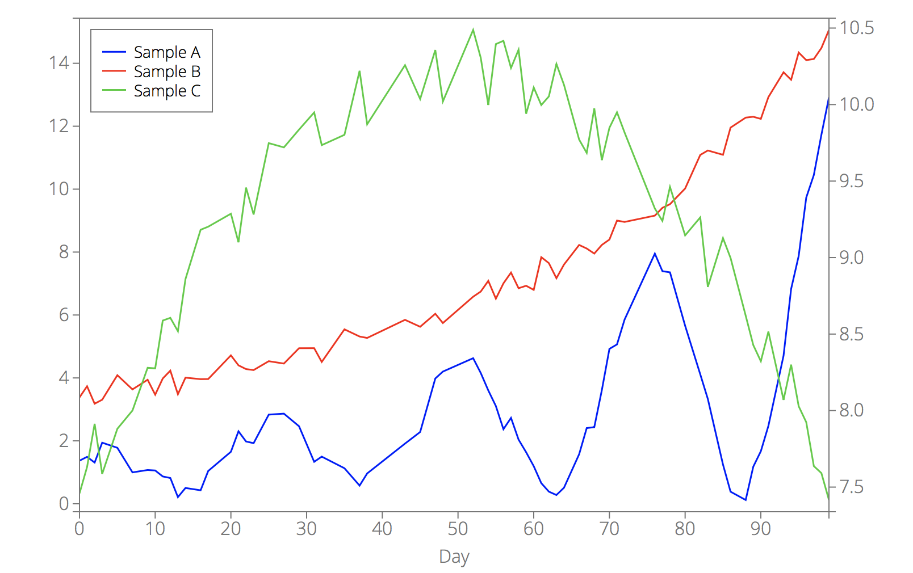

#### <a name="plot_options_category_lines"></a>Line options

<!-- LINE_COLOR -->
<a name="plot_option_line_color"></a>**`line_color`** - a color or an array of colors for the lines.
The colors are the ones supported by D3 and can be any CSS color representation (rgb, hex, named color, ...).
By default, `line_color = ['blue', 'red', 'limegreen', 'magenta', 'cyan', 'black', 'orange']`.

If `line_color` is a string, all lines will have the same color. For example:

```javascript
d3.csv("example2.csv", function(error, data) {
    var options = {
        data: data,
        xkey: "Day",
        line_color: "blue",
    };
    d3lines.plot(svg, options);
});
```

<p align="center"></p>

If `line_color` is an array (of strings), the first line will have the first color, the second line the second color, ...
If the array length is less than the number of lines, the colors will be repeated.

```javascript
d3.csv("example2.csv", function(error, data) {
    var options = {
        data: data,
        xkey: "Day",
        line_color: ["steelblue", "#f77", "rgb(250, 120, 240)"],
    };
    d3lines.plot(svg, options);
});
```

<p align="center"></p>

----

<!-- LINE_WIDTH -->
<a name="plot_option_line_width"></a>**`line_width`** - a width/thickness or an array of widths for the lines.
By default, `line_width = 1.5`.

If `line_width` is a float, all lines will have the same width. Use an array (of floats) to specify different widths for different lines.
If the array length is less than the number of lines, the widths will be repeated.

```javascript
d3.csv("example2.csv", function(error, data) {
    var options = {
        data: data,
        xkey: "Day",
        line_width: [1, 3.5, 1],
    };
    d3lines.plot(svg, options);
});
```

<p align="center"></p>

----

<!-- LINE_STYLE -->
<a name="plot_option_line_style"></a>**`line_style`** - a style (solid, dotted, ...) or an array of styles for the lines.
By default, `line_style = "-"` (solid).

If `line_style` is a string, all lines will have the same style. Use an array (of strings) to specify different styles for different lines.
If the array length is less than the number of lines, the styles will be repeated.

Possible styles are:
- "-" or "solid"
- ":" or "dotted"
- "--" or "dashed"
- "-." or "dash-dot"

For example,
```javascript
d3.csv("example2.csv", function(error, data) {
    var options = {
        data: data,
        xkey: "Day",
        line_style: ['dash-dot', ':', '--'],
    };
    d3lines.plot(svg, options);
});
```

<p align="center"></p>

It is also possible to use custom styles by providing a dash array string, that is a string representing the dashes and the spaces between the dashes. For example, the `dotted` style has a dash array of "1 1" (1-px dash and 1-px space), the `dashed` style has a dash array of "3 3" and the `dash-dot` style has a dash array of "5 2 1 2".

```javascript
d3.csv("example2.csv", function(error, data) {
    var options = {
        data: data,
        xkey: "Day",
        line_style: "3 5 3 5 3 5 10 5 10 5 10 5",
    };
    d3lines.plot(svg, options);
});
```

<p align="center"></p>

----

<!-- LINE_FILL -->
<a name="plot_option_line_fill"></a>**`line_fill`** - a fill color or an array of fill colors for the areas under the lines.
By default, `line_fill = "none"` (no fill color).

If `line_fill` is a string, all lines will have the same fill color. Use an array (of strings) to specify different fill colors for different lines.
If the array length is less than the number of lines, the fill colors will be repeated.

Note that the fill color might hide some of the data. In that case, you can play with [**`line_fill_opacity`**](#plot_option_line_fill_opacity) to change the transparency of the areas under the lines.

See [**`line_color`**](#plot_option_line_color) for color options.

For example,
```javascript
d3.csv("example2.csv", function(error, data) {
    var options = {
        data: data,
        xkey: "Day",
        line_fill: ["lightgrey", "none", "none"],
    };
    d3lines.plot(svg, options);
});
```

<p align="center"></p>

You can set `line_fill` to "color" to have all fill colors equal to the line colors.

```javascript
d3.csv("example2.csv", function(error, data) {
    var options = {
        data: data,
        xkey: "Day",
        line_fill: "color",
    };
    d3lines.plot(svg, options);
});
```

----

<!-- LINE_FILL_OPACITY -->
<a name="plot_option_line_fill_opacity"></a>**`line_fill_opacity`** - a fill opacity or an array of fill opacities for the areas under the lines. Opacities should be floats between 0.0 (transparent) and 1.0 (opaque).
By default, `line_fill_opacity = 1.0`.
Note that `line_fill_opacity` only affects the lines that have a `line_fill` different than "none".

If `line_fill_opacity` is a float, all lines will have the same fill opacity. Use an array (of floats) to specify different fill opacities for different lines.
If the array length is less than the number of lines, the fill opacities will be repeated.

```javascript
d3.csv("example2.csv", function(error, data) {
    var options = {
        data: data,
        xkey: "Day",
        line_fill: "color",
        line_fill_opacity: 0.1,
    };
    d3lines.plot(svg, options);
});
```

<p align="center"></p>

----

<!-- MARKER -->
<a name="plot_option_marker"></a>**`marker`** - a marker/symbol or an array of markers for the lines.
By default, `marker = ""` (no marker).

If `marker` is a string, all lines will have the same marker. Use an array (of strings) to specify different markers for different lines.
If the array length is less than the number of lines, the markers will be repeated.

Possible values are:
- "" (no marker)
- "o" or "circle"
- "s" or "square"
- "d" or "diamond"
- "+" or "cross"
- "^" or "triangle-up"
- "v" or "triangle-down"

For example,
```javascript
d3.csv("example2.csv", function(error, data) {
    var options = {
        data: data,
        xkey: "Day",
        marker: ["o", "s", "v"],
    };
    d3lines.plot(svg, options);
});
```

<p align="center"></p>

----

<!-- MARKER_FILL -->
<a name="plot_option_marker_fill"></a>**`marker_fill`** - a fill color or an array of fill colors for the markers.
By default, `marker_fill = "white"`.
Note that this option will only affect the lines that have makers.

If `marker_fill` is a string, all markers will have the same fill color. Use an array (of strings) to specify different marker fill colors for different lines.
If the array length is less than the number of lines, the marker fill colors will be repeated.

See [**`line_color`**](#plot_option_line_color) for color options.

For example,
```javascript
d3.csv("example2.csv", function(error, data) {
    var options = {
        data: data,
        xkey: "Day",
        marker: ["o", "s", "v"],
        marker_fill: ["limegreen", "none", "yellow"],
    };
    d3lines.plot(svg, options);
});
```

<p align="center"></p>

You can set `marker_fill` to "color" to have all marker fill colors equal to the line colors.

```javascript
d3.csv("example2.csv", function(error, data) {
    var options = {
        data: data,
        xkey: "Day",
        marker: ["o", "s", "v"],
        marker_fill: "color",
    };
    d3lines.plot(svg, options);
});
```

----

<!-- MARKER_FILL_OPACITY -->
<a name="plot_option_marker_fill_opacity"></a>**`marker_fill_opacity`** - a fill opacity or an array of fill opacities for the markers. Opacities should be floats between 0.0 (transparent) and 1.0 (opaque).
By default, `marker_fill_opacity = 1.0`.
Note that this option only affects the lines that have markers and a `marker_fill` different than "none".

If `marker_fill_opacity` is a float, all lines will have the same marker fill opacity. Use an array (of floats) to specify different marker fill opacities for different lines.
If the array length is less than the number of lines, the marker fill opacities will be repeated.

```javascript
d3.csv("example2.csv", function(error, data) {
    var options = {
        data: data,
        xkey: "Day",
        marker: ["o", "s", "v"],
        marker_fill: "color",
        marker_fill_opacity: 0.2,
    };
    d3lines.plot(svg, options);
});
```

<p align="center"></p>

----

<!-- MARKER_STROKE_WIDTH -->
<a name="plot_option_marker_stroke_width"></a>**`marker_stroke_width`** - a width/thickness or an array of widths for the marker edges.
By default, `marker_stroke_width = 1.0`.
Note that this option only affects lines that have markers.

If `marker_stroke_width` is a float, all markers will have the same stroke width. Use an array (of floats) to specify different marker stroke widths for different lines.
If the array length is less than the number of lines, the marker stroke widths will be repeated.

```javascript
d3.csv("example2.csv", function(error, data) {
    var options = {
        data: data,
        xkey: "Day",
        marker: ["o", "s", "v"],
        marker_fill: "color",
        marker_fill_opacity: 0.2,
        marker_stroke_width: 0.5,
    };
    d3lines.plot(svg, options);
});
```

<p align="center"></p>

----

<!-- MARKER_SIZE -->
<a name="plot_option_marker_size"></a>**`marker_size`** - a size or an array of sizes for the markers.
By default, `marker_size = 8`.
Note that this option only affects lines that have markers.

If `marker_size` is a float, all markers will have the same size. Use an array (of floats) to specify different marker sizes for different lines.
If the array length is less than the number of lines, the marker sizes will be repeated.

```javascript
d3.csv("example2.csv", function(error, data) {
    var options = {
        data: data,
        xkey: "Day",
        marker: ["o", "s", "v"],
        marker_size: [3, 12, 5.5],
    };
    d3lines.plot(svg, options);
});
```

<p align="center"></p>

----

<!-- line_yaxis -->
<a name="plot_option_line_yaxis"></a>**`line_yaxis`** - specifies the y-axis (left or right) for the lines.
By default, `line_yaxis = "left"`. This option allows to have two sets of y-axes.

If `line_yaxis` is a string ("left" or "right", all line will have the same y-axis. Use an array (of strings) to specify different y-axes for different lines.
If the array length is less than the number of lines, the y-axes will be repeated.

```javascript
d3.csv("example2.csv", function(error, data) {
    var options = {
        data: data,
        xkey: "Day",
        line_yaxis: ["left", "left", "right"]
    };
    d3lines.plot(svg, options);
});
```

<p align="center"></p>

----

<!-- plot_type -->
<a name="plot_option_plot_type"></a>**`plot_type`** - Specifies the type of plot (line or scatter plot). By default, `plot_type = "line"`.

```javascript
d3.csv("example2.csv", function(error, data) {
    var options = {
        data: data,
        xkey: "Day",
        plot_type: "scatter"
    };
    d3lines.plot(svg, options);
});
```

<p align="center"></p>

`plot_type` is simply a wrapper for a few different options, in such a way that the above code is equivalent to:

```javascript
d3.csv("example2.csv", function(error, data) {
    var options = {
        data: data,
        xkey: "Day",
        line_width: 0,
        marker: ["o", "s", "v", "d", "^", "+"],
        marker_fill: ["#ddf", "#fdd", "#ded", "#fdf", "#dff", "#ddd", "#fed"],
        marker_fill_opacity: 1.0
    };
    d3lines.plot(svg, options);
});
```
